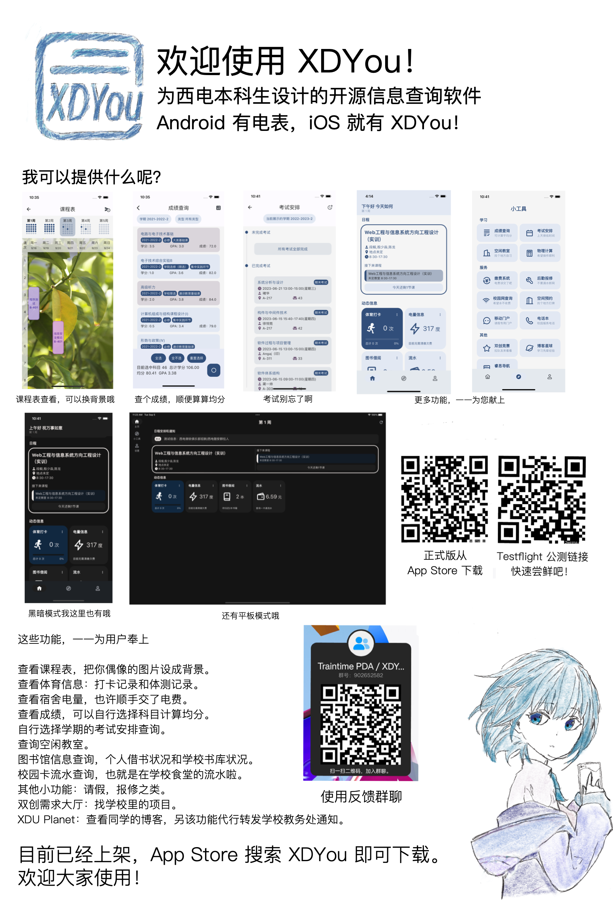

# Traintime PDA

Traintime PDA，又称 XDYou，是为西电本科生设计的开源信息查询软件。

主页和下载地址：[https://legacy.superbart.xyz/xdyou.html](https://legacy.superbart.xyz/xdyou.html)

赞助地址：[http://afdian.net/a/benderblog](http://afdian.net/a/benderblog)

[](https://apps.apple.com/us/app/xdyou/id6461723688?l=zh-Hans-CN)

[](https://f-droid.org/packages/io.github.benderblog.traintime_pda)

[](https://github.com/BenderBlog/traintime_pda/releases)
    


## 特性概览

1. 查看课程表，把你偶像的图片设成背景。
2. 查看体育信息：打卡记录和体测记录。
3. 查看宿舍电量，也许顺手交了电费。
4. 查看成绩，包括可以自行选择科目计算均分。
5. 自行选择学期的考试安排查询。
6. 查询空闲教室。
7. 图书馆信息查询，个人借书状况和学校书库状况。
8. 校园卡流水查询，也就是在学校食堂的流水啦。
9. 其他小功能：请假，报修之类。
10. 双创需求大厅：找学校里的项目。
11. XDU Planet：查看同学的博客，另该功能代行转发学校教务处通知。

## 其他特性

1. 代码完全开源，结构清晰明了，[查看我程序的架构图](https://legacy.superbart.xyz/writing/XDYou%20SAD.html)。
2. 使用广受赞誉的 Flutter 架构，跨平台而且性能高。
3. 开发者很不正经()

## 编译环境

```bash
[superbart@superbart-laptop watermeter]$ flutter --version
Flutter 3.10.6 • channel stable • https://github.com/flutter/flutter.git
Framework • revision f468f3366c (9 天前) • 2023-07-12 15:19:05 -0700
Engine • revision cdbeda788a
Tools • Dart 3.0.6 • DevTools 2.23.1
```

注意：要编译此项目，Dart 编译器必须在 3.0 以上。

还有，本代码附带 XDYou 的图标，该图标仅作为标识 iOS 授权者编译版本而使用。

## 感谢名单


如果你对本程序啥想法，欢迎向我提出。
