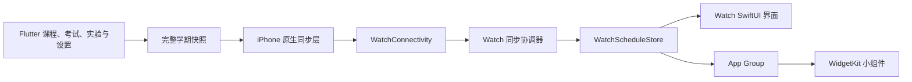
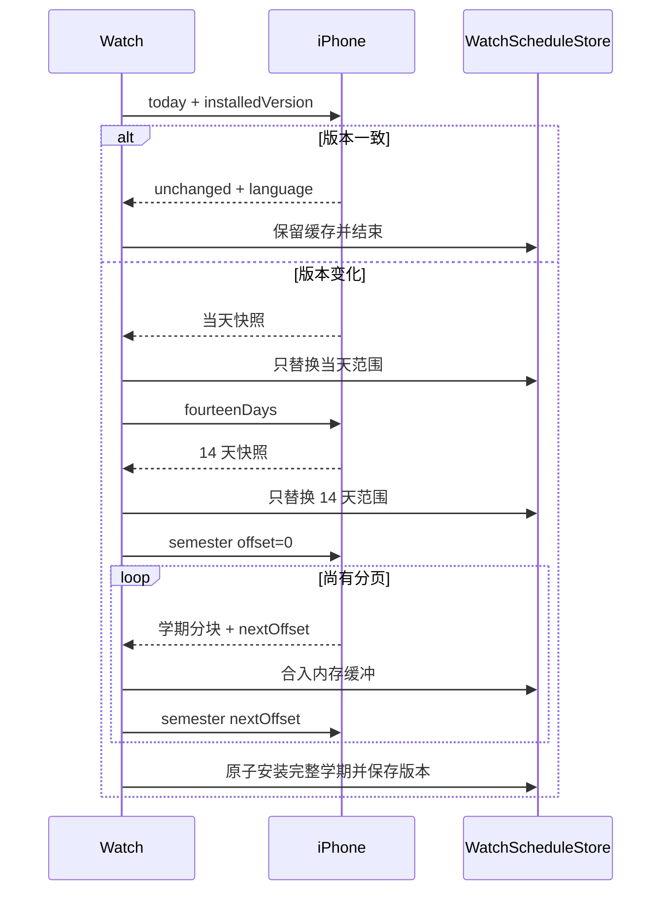

# XDYou Apple Watch 技术说明

## 总体架构

Apple Watch 功能采用 **iPhone 主数据源 + 原生 watchOS Companion App**
架构。手机负责登录、访问校园系统、合并业务数据和生成课表；手表不保存账号
凭据，也不直接访问学校接口，只展示手机已经展开到具体日期和时间的日程。



系统分为五层：

1. **Flutter 业务层**：课程、自定义课程、考试、实验、学期、周次、提醒和
   App 语言的唯一事实来源；
2. **快照层**：把重复课表展开成带绝对起止时间、节次、颜色和类型的完整
   学期 JSON；
3. **iPhone 通信层**：保存最新完整快照、计算语义版本，并按手表请求裁剪
   当天、近 14 天或学期分页；
4. **Watch 状态层**：负责三阶段同步、校验、范围合并、持久化和派生索引；
5. **展示层**：Watch App 与 Widget 只读取已经校验并安装的数据。

数据单向流动。手表发往手机的内容只有同步请求、范围、分页偏移、请求标识和
已完整安装的版本号，不会回传本地完整课表。

## 数据归属与模块边界

| 数据或状态 | 写入方 | 读取方 |
| --- | --- | --- |
| 原始课程、考试、实验与设置 | Flutter | 快照构建层 |
| 完整学期快照与语义版本 | iPhone 原生层 | Watch 通信层 |
| 当前可见课表与三级缓存 | `WatchScheduleStore` | Watch 各视图 |
| 排序、按日分组和五段课程 ID 索引 | `WatchScheduleStore` | 列表、日、周、月视图 |
| 月份网格和三页预热窗口 | `MonthCalendarCache` | 月视图 |
| 日视图卡片高度 | `DayCourseLayoutTracker` | 日视图纵向导航 |
| 页面位移、表冠会话和吸附状态 | 对应 SwiftUI View | 仅对应页面 |
| Widget 课表、语言与交互状态 | App Group | Widget Extension |

主要目录：

| 路径 | 职责 |
| --- | --- |
| `lib/repository/watch/` | 构建完整学期快照并监听手机数据变化 |
| `ios/Runner/WatchConnectivityManager.swift` | iPhone 快照、版本、范围裁剪与回复 |
| `ios/Runner/PhoneWatchQueuedScheduleTransport.swift` | 后台队列请求转发与关联 |
| `watchOS/Connectivity/WatchConnectivityManager.swift` | Watch 三阶段同步状态机 |
| `watchOS/Storage/WatchScheduleStore.swift` | 快照安装、缓存、索引和公开状态 |
| `watchOS/Storage/DayCourseLayoutCache.swift` | 卡片高度采样、双向位移换算和可暂停持久化 |
| `watchOS/Shared/WatchWidgetShared.swift` | App Group、语言、缓存键和通用编码 |
| `watchOS/Views/RootScheduleView.swift` | 顶层路由、提示、悬浮控件和详情层 |
| `watchOS/Views/OverviewScheduleView.swift` | 当前或下一节课程概览 |
| `watchOS/Views/CourseListView.swift` | 整学期自然日分组列表 |
| `watchOS/Views/DayScheduleView.swift` | 单日课程、纵向浏览与横向翻日 |
| `watchOS/Views/WeekScheduleView.swift` | 周次边界、七日网格与色块命中 |
| `watchOS/Views/MonthScheduleView.swift` | 月份网格、日程标记与日期提交 |
| `watchOS/Views/MonthCalendarData.swift` | 月份轻量模型、标记组装和三页内存缓存 |
| `watchOS/Views/CourseViews.swift` | 共用课程卡片和顶层详情页 |
| `watchOS/Views/CalendarPagingSupport.swift` | 日/周/月共用分页、吸附和表冠桥接 |
| `watchOS/Views/InteractionAwareScrollView.swift` | 列表滚动观察和顶部保护 |
| `watchOS/Views/WatchInteractionSupport.swift` | 可取消任务、按压状态、完成去重、触觉和表冠连续会话 |
| `watchOS/Views/WatchOnboardingView.swift` | 新手引导步骤、顶层遮罩和动作动画 |
| `watchOS/Widget/` | 表盘 Complication、Smart Stack 与时间线 |

通信层不保存 SwiftUI 页面状态，View 不直接解析 WatchConnectivity 字典；
Store 不持有页面手势和动画状态。

## 状态与任务生命周期

`RootScheduleView` 只持有跨页面路由和短生命周期 UI 状态。异步任务按职责分组：

- 悬浮控件组：按钮自动隐藏、缓存提示和引导完成提示；
- 引导组：章节过渡、首轮渲染准备和表冠停止判定；
- 月视图预热组：不可交互月视图的短时挂载。

根页面消失、引导重新开始或引导完成时，通过统一取消入口结束对应 Task 并清空
引用。引导正常推进和错误恢复共用同一个路由安装函数，模式、教学日期、日期
选择器、详情课程和悬浮控件状态会作为一组提交，避免两条路径形成不同状态。

`WatchScheduleStore` 是可见课表和派生索引的唯一写入者。快照安装、索引恢复、
课程列表入口和月份预热都由 Store 的明确入口完成；视图只调用查询方法。可恢复
错误统一带阶段标签写入系统日志，用户提示与缓存回退仍由发生错误的业务入口
决定。

## 手机端课表生产

### 完整快照

Flutter 将以下内容转换为统一的 `WatchCourseOccurrence`：

- 学校课程；
- 自定义课程；
- 考试及座位号；
- 物理实验和其他实验；
- 学期起点、当前周次和数据覆盖范围；
- 时区、提醒提前时间和与手机端一致的课程颜色。

日程类型包括 `course`、`exam`、`physicsExperiment` 和
`otherExperiment`。当前快照 schema 为 4，Watch App 与 Widget 共同使用
`WatchWidgetShared.supportedScheduleSchemaVersions` 校验支持范围。

### 语义版本

iPhone 对规范化后的完整学期快照计算 SHA-256。生成时间等不影响展示的临时
字段不参与版本；课程、日期、节次、颜色、周次、地点、教师或座位发生变化时
会产生新版本。

手表请求携带已完整安装的版本号：

- 版本一致：手机返回 `scheduleUnchanged` 和轻量设置，不发送课表正文；
- 版本不同或手表没有完整版本：执行当天、14 天、学期三阶段同步。

只有完整学期所有分页安装成功后，手表才持久化新版本。局部缓存不能代表完整
课表，因而当天或 14 天阶段不会提前更新版本号。

## 渐进同步

### 阶段顺序



同一轮三个阶段必须属于同一版本。中途版本变化时，Watch 丢弃学期缓冲并从
当天重新开始，避免把两份课表拼接在一起。

### 通信通道

| 通道 | 用途 |
| --- | --- |
| `sendMessage` | 前台可达时的低延迟请求与回复 |
| `transferUserInfo` | 实体表即时失败后的后台队列 |
| `updateApplicationContext` | 最新 14 天快照、版本和语言的启动兜底 |

即时和后台通道共用 iPhone 的回复生成函数，范围过滤、版本判断和分页语义保持
一致。后台回复通过 `refreshID` 与 `requestID` 去重；旧刷新、重复投递和迟到
分页不会覆盖当前数据。

### 启动与离线

Watch App 每次打开或回到前台都会请求同步：

- 3 秒内没有手机回复且存在有效学期缓存：继续展示缓存，并显示可轻点关闭、
  15 秒自动消失的紧凑提示；
- 没有任何可展示学期日程：显示“请打开手机 XDYou”页面；
- 同步阶段失败或超时：保留原页面和原缓存；
- 每个阶段成功后立即替换该阶段覆盖范围，不清除范围外日期。

## 启动准备与交互性能

启动工作按“数据依赖是否已经具备”分成三层，避免把可以提前完成的计算推迟到
用户第一次进入页面时：

| 时机 | 完成的工作 | 不在此阶段执行的工作 |
| --- | --- | --- |
| `WatchScheduleStore` 初始化 | 解码三级课表缓存、校验并恢复派生索引、计算列表入口与教学日期、预热当前月份和教学月份的相邻三页 | 网络请求、SwiftUI 页面创建 |
| 根视图首帧之后 | 激活 WatchConnectivity、发送带已安装版本号的同步请求、短暂预挂载不可交互的月视图渲染树 | 整学期排序、JSON 编码 |
| 已知表盘宽度之后 | 校验日卡片布局签名并恢复卡片高度 | 与当前宽度不匹配的布局缓存 |

课表索引安装后，列表、日、周、月和教学入口只读取数组或日期字典，不在手势、
表冠和动画逐帧路径中扫描整学期。教学日期在安装索引时一次算好；月份窗口在
Store 初始化或新课表安装时准备。只有依赖真实 SwiftUI 几何的卡片高度和控件
坐标必须等页面完成布局后采样。

月份缓存除单月日期模型和五段课程标记外，还以中心月为键保存已经组装好的
前、中、后三页原子窗口。根视图首帧完成后会以近乎透明、禁止命中且不申请
表冠焦点的方式短暂挂载一次真实 `MonthScheduleView`，提前建立
`NavigationStack`、分页器、Canvas 和工具栏的首次渲染管线，随后自动移除。
首次打开月视图直接读取已准备的数据窗口和已经建立的渲染管线。

派生索引和卡片高度先立即更新内存，再由可取消的后台任务编码 JSON。连续收到
当天、14 天和学期数据时，仅最新代次允许写入 Defaults；过期任务即使完成也
不会覆盖新索引。这样阶段数据仍能立即刷新页面，同时磁盘工作不会占用交互帧。

## 持久化缓存

缓存按数据生命周期拆分，不能简单合成一个大对象。课表正文需要阶段级原子
替换；派生索引可重建；卡片高度还受语言和表盘宽度影响。分层存储能让单项
损坏只触发该层重建。

### 缓存清单

| 缓存 | 存储位置 | 内容 | 失效或重建条件 |
| --- | --- | --- | --- |
| 当天课表 | Standard + App Group | 当天完整快照 | 新当天阶段完成 |
| 近 14 天课表 | Standard + App Group | 14 天完整快照 | 新 14 天阶段完成 |
| 完整学期课表 | Standard + App Group | 权威学期快照 | 学期全部分页完成 |
| 已安装版本 | Standard | iPhone 语义版本 | 完整学期缺失或新学期安装 |
| 展示派生索引 | Standard | 排序 ID、自然日分组、五段标记、列表入口 | 来源快照不匹配或 schema 变化 |
| 日卡片布局 | Standard | 课程 ID 到实测卡片高度 | 当前快照修订、语言、宽度、动态字体或粗体设置变化 |
| 月份预热窗口 | 运行时内存 | 最多八个中心月的三页网格与标记 | 课表、系统日历或时区变化；超限淘汰最近最少访问窗口 |
| Widget 交互状态 | App Group | 综合组件当前课程 ID 与下一节预览截止时间 | 五分钟、当前下课、下一项上课或当前 ID 改变 |

私有缓存键统一定义在 `WatchPersistentCacheKey`；Codable Data 的编码和读取统一
经过 `WatchCacheCoding`。课表正文的三个共享键及其稳定读取顺序由
`WatchWidgetShared` 唯一维护，Store 与 Widget 读取同一组键名和 schema 范围。

### 原始课表恢复

启动时每个范围分别解码 Standard 与 App Group 两份候选，选择修订较新的有效
副本；坏数据只影响自身。`WatchScheduleResolver` 按 `sourceRevision` 排序，旧
协议缺少修订号时才用生成时间。同一修订号中完整学期具有最终权威性。

同学期的新当天或 14 天快照只覆盖自己的明确范围，保留范围之外的课程；范围
内空数组也代表取消全部日程。不同学期不拼接。每段覆盖范围保留自己的有效期，
局部更新不能延长其他日期旧数据的有效期。概览复用索引安装时计算好的合并结果。

清空和退出通过独立协议传递 `scheduleCleared`、`signedOut`、`stateRevision`
和 `accountGeneration`。旧修订或旧账号回复不能恢复已清空课表；本地索引、卡片
高度、Widget 预览和教学目标同时失效。完整学期缺失时会清除孤立版本号，防止
只有版本、没有正文却向手机误报“无需更新”。

### 持久化派生索引

`WatchScheduleStore` 在快照安装时一次生成：

- 稳定排序后的课程数组；
- `Date -> [WatchCourse]` 自然日索引；
- 课程列表分组和首次定位日期；
- `courseID -> WatchCourse` 映射；
- 每日五个两节区间对应的课程 ID。

新建和恢复最终都经过 `installVisibleScheduleIndex`，确保所有派生字段原子安装。
派生索引 schema 为 2，来源身份包含原快照 schema、生成时间、单调修订号、范围、
课程数量、系统日历和时区。全部匹配才复用；旧版索引会自动从原始快照重建。iPhone 的语义版本仍是“课表是否变化”的唯一
依据，来源身份仅防止本地文件错配。

恢复流程按职责拆分：先校验缓存与原始快照身份，再恢复课程 ID 和自然日索引，
最后恢复课程列表入口。重复日期和跨日课程标记均会被拒绝。跨自然日时只重算
列表入口；任一结构校验失败则整体回退
到原始课表重建，不安装部分索引。

课程列表入口、教学示例日期和索引课程数量也在安装入口中一次更新，后续完整性
检查和教学启动均为常量时间。派生缓存 JSON 在后台编码；主线程只负责安装内存
值和提交最终 `Data`。

### 月视图运行时预热

`MonthCalendarCache` 管理两类生命周期不同的数据：

- 日期网格依赖年月、系统日历和时区，可跨课表版本复用；
- 五段标记引用当前课表课程，课表索引变化时单独失效。

Store 恢复派生索引后立即预热当前月及前后两月。日视图选择日期变化时预热该
日期对应的三页窗口；月视图只接收已经成组准备好的日期模型和标记字典。页面
入场、横向拖动和表冠逐帧路径因此只读取内存，不执行整学期扫描、颜色转换或
持久化编码。

缓存保留最近访问的八个中心月。淘汰窗口时，同时释放不再被窗口引用的单月网格
和课程标记，最多保留 24 份单月数据。前台恢复或系统时区通知会校验日历环境，
变化后重建自然日索引和月份窗口，不改动原始课程时间戳。

### 日视图布局缓存

日视图使用课程真实卡片高度把连续课程索引换算成像素位移。高度缓存签名包含：

- 当前可见快照 schema、修订号、生成时间和数量，不能只依赖旧完整学期版本；
- 手机同步的界面语言；
- 当前表盘内容宽度、Dynamic Type 大小和文字粗细；
- 布局缓存 schema。

相邻三页预先测量卡片，测量结果先合并到内存。手指或表冠逐帧操作期间暂停
新的 JSON 编码，暂停期间新增测量也不能重新排队写盘；已开始的后台编码允许
完成计算，但取消检查会阻止提交。停止交互后仍按原有 1.5 秒
延迟合并写盘。页面离开取消任务，清空代次阻止后台编码结果重新写回。恢复高度
时过滤非法数值。实现独立于 View，可以使用临时 Defaults 直接运行回归测试。

## Watch App 界面

三点按钮提供五种模式：

1. **概览**：显示正在进行的课程，否则显示未来最近一节；
2. **课程列表**：按自然日分组浏览整学期日程；
3. **日视图**：浏览单日课程卡片；
4. **月视图**：浏览月份并选择日期；
5. **周视图**：显示第 1–10 节的七日色块网格。

课程、考试和实验使用手机传来的颜色。列表和日视图使用 24 小时制，地点与
教师或考试座位号同行显示，超出宽度时尾部省略。

概览、课程列表和课程详情都使用 `InteractionAwareScrollView` 区分触摸和
表冠输入。概览与详情等普通内容先测量自然高度；课程列表的 `LazyVStack`
保留系统 ScrollView 的原生尺寸提案，以便懒加载内容建立完整滚动范围。
长列表和详情只观察系统 ScrollPhase，不安装额外 DragGesture，保证真实内容
始终跟手；只有不足一屏且系统可能漏报 `.tracking` 的概览教学会启用轻量触摸
兜底。详情覆盖周视图时，焦点直接交给内部原生 ScrollView，关闭后再由周视图
恢复焦点。

### 新手引导

引导由四部分组成：

| 组件 | 职责 |
|---|---|
| `WatchOnboardingStep` | 定义教学顺序、页面、标题、动作说明和期望操作 |
| `WatchOnboardingInputBridge` | 接收页面旁路上报的操作，判定成功或错误并推进步骤 |
| `WatchOnboardingOverlay` | 显示遮罩、进度、动作动画和结果动画 |
| `RootScheduleView` | 切换教学页面、准备示例日期和课程、保存完成状态 |

每个 `WatchOnboardingStep` 只对应一个 `WatchOnboardingOperation`。标题统一为
“视图·任务”，例如“日视图·翻页”；说明同时写明输入方式和结果，例如
“用手指左右滑动屏幕，以切换前后日期”。动作位置由动画提供。教学顺序为：

1. 概览：纵向浏览、表冠浏览、悬浮按钮、刷新和视图列表；
2. 课程列表：触摸浏览和表冠浏览；
3. 日视图：卡片浏览、四种翻日操作、打开月历和选择日期；
4. 周视图：箭头/滑动/表冠翻周、打开课程详情和关闭详情；
5. 月视图：箭头/滑动/表冠翻月、选择日期和退出；
6. 按住右下角切换按钮 3 秒重新打开引导。

欢迎页、每个视图的分段页和完成页使用纯黑背景并等待轻点。欢迎页不显示
章节进度；预热期间显示“正在加载新手引导”和不带百分比的白色不定量进度
条，完成后播放一次成功触觉并替换为“轻点屏幕以开始”。五个视图分段页
显示 `1/5` 至 `5/5`。实操步骤在实际页面上显示“当前步骤/总步骤 + 标题”；
标题和底部动作指令共用同一组左右边界，标题采用圆角矩形液态玻璃，底层使用
单条蓝色连续进度。纯黑页的提示字形使用
`WatchOnboardingSweepingLightText` 绘制斜向变速柔光。表冠提示靠近表盘右侧，
垂直中心约为教学视口高度的 27%，并为屏幕边缘保留最小间隙。

刷新、切换、详情关闭等浮动控件读取实际全局 frame；周分页器只允许当前页
上报课程几何，并要求至少 80% 的色块面积位于教学视口内，随后冻结目标中心，
避免预渲染的前后周色块抢先成为点击提示。日、周、月共用的标题栏宽度和
偏移固定，左右箭头提示直接复用同一组响应式固定中心，不在分页重建时重复
采样。`RootScheduleView` 将动态目标的 frame 中心转换为引导视口坐标，保证
提示与控件中心一致，表冠输入不会被当成色块点击。

真实页面负责执行操作，实操说明、动作提示和结果层使用 `allowsHitTesting(false)`。
欢迎、章节和完成页保留原本的轻点入口。旁路回调把真实输入交给
`WatchOnboardingInputBridge`，不会使用覆盖层模拟一次成功操作。

| 系统版本 | 原生滚动完成判定 | 教学触摸视觉 |
| --- | --- | --- |
| watchOS 11 及以上 | `ScrollPhase` 区分 tracking/interacting/idle；手指标记防止短内容被误认成表冠 | 概览使用弹性偏移；列表通过 `ScrollPosition` 连续定位 |
| watchOS 10 | 触摸结束兜底；开启来源标记且没有程序化视觉代理的教学中，用真实位移和 0.35 秒静止补报表冠；惯性尾段继续保留触摸来源 | 概览保留弹性偏移；列表保留系统滚动，不调用不可用的 `ScrollPosition` |

正常浏览的原生滚动物理不变。教学触摸代理沿用现有参数，只有指定步骤禁用原生
位移，避免系统与代理双重推动。`WatchInputCompletionGate` 使系统 idle 和 0.08 秒
触摸兜底只能完成同一次操作一次；教学上下文变化、页面离开和系统取消均取消
旧任务并推进代次。watchOS 10 的来源判定是兼容推断，仍需要实体表验证。

`GestureState` 会在系统取消手势时自动复位，因此分页器和模式按钮都能处理没有
`onEnded` 的取消路径。取消分页只收回当前位移，不提交教学或额外翻页；模式
按钮拖出 36pt 后整轮作废，移回也不重启三秒长按。有效表冠事件才会提交教学，
会话间隔使用单调时钟，避免手机校时污染方向判断。API 行为参考
[Apple 手势回调说明](https://developer.apple.com/documentation/SwiftUI/Adding-Interactivity-with-Gestures)
与 [ScrollPhase](https://developer.apple.com/documentation/swiftui/scrollphase)。

用户开始滑动或转动表冠时，说明和暗层淡出；触摸抬起、滚动停止或表冠停止后
判定结果。成功反馈使用纯黑背景、绿色圆环和对号；错误反馈保留当前页面并
显示白色错号。错误步骤会恢复进入该步骤前的页面状态。

引导会使用 Store 在索引安装阶段选出的教学日期：优先日程较多的日期，并在
数量相同时选择距离今天较近的一天。完成后写入
`XDYouWatchCompletedOnboardingV1`，完成页等待轻点退出。右下角切换按钮按住
3 秒可重新开始引导；有效按压提前松开则打开视图列表。

引导入口先检查 Store 是否能给出本学期教学日期。没有任何可用日程时不创建
欢迎页和教学状态机，而是停留在手机同步页面并提示用户在 iPhone 的 XDYou 中
点按刷新；日程到达后再自动开始引导。进入引导后先显示欢迎页和“正在加载
新手引导”；Store 的课程列表索引、示例日期和月份窗口通常已在初始化完成，
欢迎页仅确认这些数据和首屏材质已经可用。
引导期间同一视图保持稳定 identity，步骤变化只更新教学状态。首次缓存缺失
且进入课程列表章节时，纯黑章节页会显示“第一次
载入课表，正在渲染底层数据”；准备完成后先给出触觉和文字确认，再允许进入
实操。章节页采用立即插入、淡出移除，底层路由只在黑色覆盖提交后变化，避免
章节交界漏出一帧页面切换。

欢迎页的“可开始”同时依赖数据准备和首屏渲染准备。加载期间会在纯黑欢迎页
背后以不可交互方式建立首个提示需要的材质和动作动画管线；两者都完成后才
显示“轻点屏幕以开始”。不可见预热树只提交首帧，不在黑场后循环播放提示或扫光。
同步变更教学目标、移除示范日期全部课程或清空课表时，旧详情与目标坐标会失效，
并重新检查教学可用性。

### 共用分页基础设施

日、周、月视图复用以下实现：

- `CalendarHorizontalPager`：稳定的前、中、后三页容器和触摸轴锁定；
- `horizontalDragMotion`：按位移、预测位置和末速度决定目标页；
- `calendarCrownPageMotion`：把表冠刻度与速度换算成横向像素；
- `normalizedContinuousPageOffset`：完整跨页后的无动画换底；
- `horizontalPageSnap`：生成目标位置和吸附时间；
- `CalendarPagingCrownInputModifier`：统一表冠范围、步长、灵敏度和系统声音；
- `CalendarCrownIdleCoordinator`：位于 `WatchInteractionSupport.swift`，统一 `onIdle`
  确认与实体表漏回调兜底，可独立运行状态机测试。

页面只保留自己的业务差异：日视图的纵向卡片阶段、周视图的学期边界、月视图
的月份模型和日期提交。共享组件不包含课程数据，也不改变页面布局。

### 日视图

- 前一天、当前日和后一天预渲染，横向触摸与页面位移保持 1:1；
- 同一个触摸层先识别横向或纵向，锁定后保持单一轴向；
- 纵向触摸和表冠共用同一内容偏移与课程索引；
- 多项日程先纵向浏览，达到末项后转入连续横向翻日；
- 零项或一项日程直接横向翻日；
- 触摸松手支持惯性、阻尼、边界回弹和末项安全留白；
- 横向完整跨屏后立即换底，持续旋转表冠可连续翻日；
- 日期标题可打开独立月份页；日视图不打开课程详情。

卡片高度预热和持久化使相邻有课日期进入屏幕前已经具备布局数据；页面偏移
变化不会重新排序课程或查询整学期快照。

### 周视图

- 周标题优先使用手机同步的周次参考；
- 可浏览范围限制在手机完整学期首周与末周；
- 当前日期列使用淡色高亮；
- 手指、标题箭头和表冠共用横向分页；
- 点击色块打开顶层课程详情，点击空白区域恢复悬浮控件；
- 学期边界使用阻尼位移和触觉反馈，不提交无效周次。

### 月视图与日期选择

月视图与日视图日期入口共用 `MonthScheduleView`：

- 页面是根视图中的独立全屏层，从底部进入和退出；
- 星期栏、月份标题和网格属于同一转场；
- 手指、表冠和标题箭头均可翻月；
- 当前月和相邻月份构成轻量三页窗口；
- 单月使用一个异步 Canvas 绘制日期、网格、今天红框和五段标记；
- 点击坐标换算为 7 列日期索引，不创建 35/42 个按钮；
- 普通日期为亮白色，选中日期为蓝色加粗；
- 今天使用透明红色粗框；有日程时红框同时包住日期和五段标记；
- 五段依次代表第 1–2、3–4、5–6、7–8、9–10 节，有课使用课程色，
  空闲段使用暗白色，整天无日程不绘制五段。

### 课程详情与悬浮控件

课程详情位于 `RootScheduleView` 最上层，从底部弹出，不使用系统 Sheet。
内容使用原生 ScrollView，手指和表冠均可滚动；关闭后再把表冠焦点交还周视图。

刷新按钮位于右上方，模式按钮位于右下方。滚动或转动表冠时自动隐藏；等待
手机或正在同步时保持显示。同步完成提示和缓存提示不阻塞页面操作。

## 国际化

Watch App 与 Widget 支持：

- 简体中文 `zh_CN`；
- 繁体中文 `zh_TW`；
- 英语 `en_US`。

手机 App 当前实际生效语言是首选来源。Watch Store 把语言写入 App Group，
App 与 Widget 共用。目录、状态和周次通过 `watchLocalizedString` 读取 String
Catalog；日期与星期使用注入的 Locale。课程、教师和地点属于用户或学校数据，
保持原文。

## 表盘 Complication 与 Smart Stack 小组件

四个组件共用 `WatchSchedulePresentation` 和同一缓存范围判定：

| 组件 | 内容职责 |
| --- | --- |
| 综合课表 | 根据当前状态显示时间、地点和课程；小尺寸优先时间与地点，圆环或条形进度辅助表达 |
| 课程名称 | 当前焦点课程名称与状态 |
| 时间地点 | 与名称组件保持同一课程，显示“距上课”“距下课”、时间、地点和进度 |
| 日程概览 | 当日或下一有课日的数量、完成情况及日周分布，不重复主课程详情 |

四种组件支持单行、圆形、表角和长方形。综合组件正常显示当前课程，当前无课则
选择下一项。距上课超过 15 分钟显示明确开始时间；进入 15 分钟内使用倒计时；
上课中显示“距下课”，不足一分钟显示“即将下课”。没有 60 分钟档、首课等待档
或固定 20:00 明日切换。实际末课结束后才显示下一有课日，使用“明日”或日期
明确标注。本学期结束显示“本学期结束，开心玩耍吧！”。

综合组件的下一节预览只影响自身：绑定当前课程 ID，并在五分钟、当前课程下课
或下一项上课中最早的时刻失效。名称和时间地点组件始终共享正常焦点，避免分
组件互相矛盾。原独立进度和本周分布组件已移出 bundle，刷新列表只包含四个仍
注册的 kind。

Timeline 节点覆盖 15 分钟阈值、上课、最后一分钟、下课、自然日和缓存失效边界。
无课、没有完整覆盖、过期、未同步及退出登录分别呈现。周矩阵仍为包括周末的
5×7 网格；Canvas 读取预计算的色格，不在每帧扫描完整课表。本次交互审计没有
调整 Widget 布局或状态阈值。

## 通知职责

课程提醒由 iPhone 本地通知系统调度并由系统转发到 Apple Watch。Watch App
不重复创建相同提醒，避免手机和手表同时通知。

## 构建与验证

在仓库根目录运行。无签名构建验证编译、链接、资源与嵌入关系，不证明实体设备
上的触觉手感、系统手势竞争或配对传输结果。

```bash
# 共享状态和缓存回归：直接编译生产 Swift 文件，使用临时 Defaults。
bash tools/test_watch_regressions.sh

# Flutter 与签名脚本回归。
CI=true .flutter/bin/flutter test --no-pub
python3 -m unittest test/signing_scripts_test.py
git diff --check

# Watch App 与 Widget；deployment target 保持 watchOS 10。
xcodebuild -project ios/Runner.xcodeproj -scheme TraintimeWatch \
  -configuration Debug -destination 'generic/platform=watchOS Simulator' \
  -derivedDataPath /tmp/xdyou-watch-validation CODE_SIGNING_ALLOWED=NO build

# iPhone 主工程，包含两个平台的小组件与 Watch App。
xcodebuild -project ios/Runner.xcodeproj -scheme Runner \
  -configuration Debug -destination 'generic/platform=iOS Simulator' \
  -derivedDataPath /tmp/xdyou-ios-validation CODE_SIGNING_ALLOWED=NO build
```

回归覆盖按钮取消与长按互斥、有效表冠与会话反转、完成去重、取消任务、触摸和
表冠位移接续、月缓存淘汰、卡片持久化暂停、清空竞态、修订变化与跨日标记
校验。界面实测重点是短概览、长课程列表、连续跨日/周/月、系统中断拖动、章节
切换期间旧输入、旋转期间同步替换，以及在 watchOS 10 与 11 以上分别确认来源。

### 签名切换

继续维护两个 Python 脚本。提交文件使用作者配置，本机调试使用个人配置：

```bash
python3 tools/signing_for_upstream.py
# 暂存本次改动后，检查真正提交的索引内容。
python3 tools/signing_for_upstream.py --check --staged
# 提交完成后恢复本地配置。
python3 tools/signing_for_local.py
python3 tools/signing_for_local.py --check
```

切换前会完整校验所有受管文件，异常时不留下部分切换。`--check --staged` 读取
Git 索引，因此可在工作区已经恢复个人签名后再次检查提交内容。真机安装要求
iPhone、Watch App 和 Widget 的 Team、App Group 与 Companion 标识一致。

## 开发约束

同步协议保持以下不变量：

1. 同步更新 Dart、iPhone Swift、Watch Swift 与 schema；
2. 验证版本一致、版本变化、分页中途版本变化三条路径；
3. 保证当天和 14 天只替换自己的范围；
4. 只在完整学期安装后保存版本；
5. 不因失败、超时或坏分页清空旧缓存。

缓存实现保持以下不变量：

1. 新缓存必须有 schema 或来源签名；
2. 可重建派生数据不要复制完整课程模型；
3. 动画和表冠逐帧路径不得编码 JSON 或写 UserDefaults；
4. App Group 键、语言和 schema 范围只在共享层定义；
5. 单项缓存损坏必须可以独立回退或重建。

界面交互保持以下不变量：

1. 复用分页纯函数和表冠协调器，不复制停止计时逻辑；
2. 保持触摸、表冠和顶部箭头经过同一页面提交入口；
3. 检查 41mm、45mm 和 49mm 表径；
4. 验证周网格色块与空白区域的命中优先级；
5. 验证简体中文、繁体中文和英语；
6. 布局调整与交互重构分开提交，便于定位回归。
