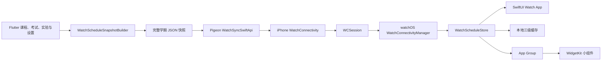
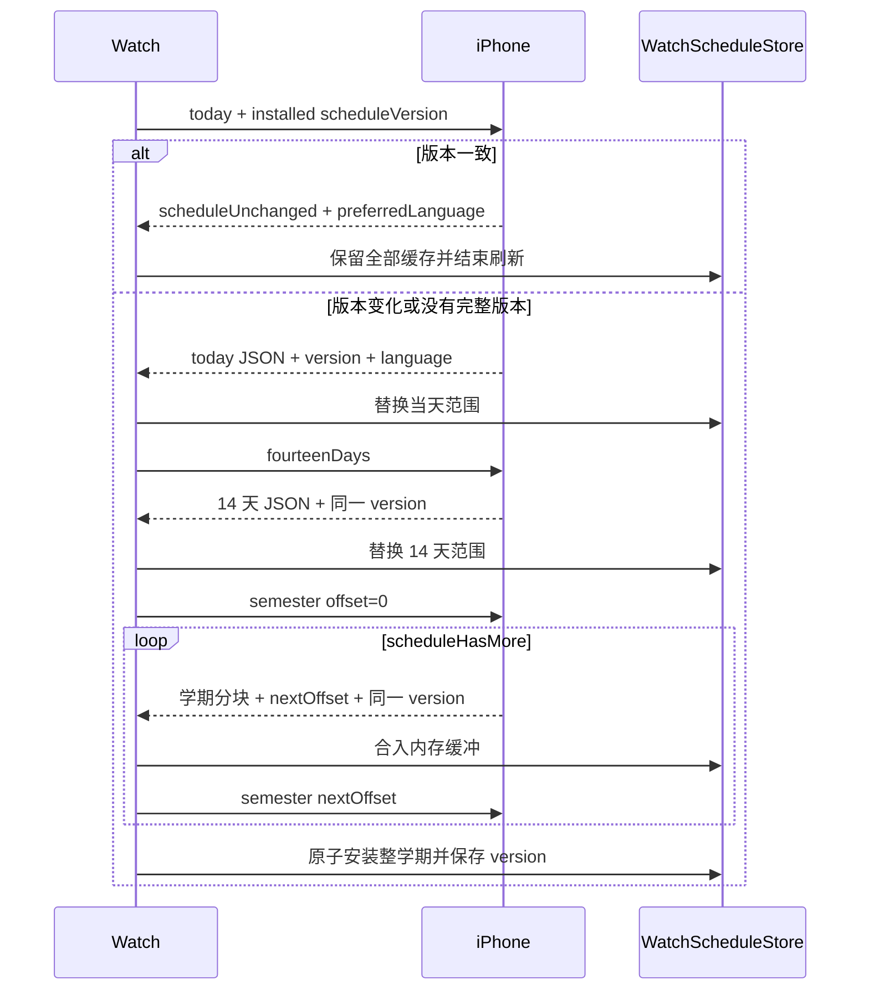

# Apple Watch 技术说明

## 总体架构说明

Apple Watch 功能采用“iPhone 主数据源 + 原生 watchOS 展示端”的 Companion
架构。手机负责登录、请求校园系统、合并业务数据和生成最终课表；手表不保存
账号凭据，也不直接访问学校接口，只接收已经展开到具体日期和时间的只读日程。

整个系统分为五层：

1. **Flutter 业务层**：管理学校课程、自定义课程、考试、实验、学期、周次、
   提醒设置和 App 语言，是课表内容的唯一事实来源；
2. **快照转换层**：`WatchScheduleSnapshotBuilder` 把不同业务模型统一转换为
   带绝对起止时间、节次、颜色和类型的完整学期 JSON 快照；
3. **iPhone 原生通信层**：通过 Pigeon 接收 Flutter 快照，计算语义版本，
   使用 `WatchConnectivity` 按当天、近 14 天和整学期范围响应手表；
4. **Watch 状态层**：`WatchConnectivityManager` 编排三阶段同步，
   `WatchScheduleStore` 负责解码、范围合并、本地缓存、派生索引和界面状态；
5. **Watch 展示层**：SwiftUI Watch App 与 WidgetKit 小组件只读取 Store 或
   App Group 中已经校验的数据，提供离线课表、日/周浏览和当前课程信息。

课表数据始终单向流动：

```text
校园系统与用户设置
    → Flutter Controller
    → WatchScheduleSnapshot
    → iPhone WatchConnectivity
    → Apple Watch 本地缓存
    → Watch App / Widget
```

手表发往手机的内容只有同步请求、请求范围、分页偏移和已完整安装的课表版本
号，不会回传完整缓存。版本一致时手机只返回轻量确认；版本变化时才执行“当天
→ 近 14 天 → 整学期”的渐进同步。每个阶段成功后独立提交，传输中断不会清空
原页面，因而手机暂时不可达时仍可继续浏览已有学期课表。

语言是独立于课表正文的轻量状态，由手机 App 的实际生效语言决定，并通过
App Group 同时提供给 Watch App 与 Widget。课程提醒继续由 iPhone 调度并由
系统转发，避免手机与手表对同一课程重复提醒。

## 系统概览



系统遵循以下约束：

- Flutter 汇总学校课程、自定义课程、考试和实验；
- iOS 原生层持有手机侧最近一份完整学期快照，并响应手表请求；
- 手表按“当天 → 近 14 天 → 整学期”渐进安装变化后的课表；
- 请求携带手表已完整安装的版本号，相同版本只返回轻量确认；
- 任一同步阶段失败时继续保留原页面和原缓存；
- 手机 App 的实际界面语言同步到 Watch App 与 Widget；
- 课程提醒由 iPhone 本地通知负责，避免手机和手表重复提醒。

## 目录与 Target

| 路径或 Target | 职责 |
| --- | --- |
| `lib/repository/watch/` | 构建完整学期快照并监听手机数据变化 |
| `pigeon_bridge/save_to_groupid.dart` | 定义 Flutter → Swift 同步接口 |
| `ios/Runner/WatchConnectivityManager.swift` | iPhone 侧快照缓存、版本计算、范围过滤与通信 |
| `watchOS/` | 原生 SwiftUI Watch App、模型、缓存、通信与资源 |
| `watchOS/Widget/` | WidgetKit Smart Stack 小组件 |
| `TraintimeWatch` | watchOS App Target |
| `TraintimeWatchWidgetExtension` | watchOS Widget Extension Target |
| `Runner` | iPhone App 与 Watch Companion 的宿主 Target |

## iPhone 数据生产

### 快照构建

`lib/repository/watch/watch_schedule_snapshot.dart` 把手机业务模型展开为具体日程。
手表接收绝对日期、起止时间和节次，不解析“第几周、星期几”的重复规则。

当前快照包含：

- 普通课程；
- 自定义课程；
- 考试及座位信息；
- 物理实验；
- 其他实验；
- 学期开始日期和手机当前周次；
- 左闭右开的数据覆盖范围；
- 快照生成时间和有效期；
- 时区偏移与提醒提前分钟数；
- 与手机课表一致的 ARGB 颜色。

`WatchCourseOccurrence` 是统一的日程模型。`kind` 的可用值为：

- `course`
- `exam`
- `physicsExperiment`
- `otherExperiment`

`WatchScheduleSnapshot.schemaVersion` 当前为 4。Swift 端接受 1 至 4，保证已保存
缓存可以逐步读取。改变字段语义时必须同步更新 Dart、Swift 和测试。

### 响应式同步服务

`WatchScheduleSyncService` 仅在 iOS 启动，通过 Signals 读取同一时刻的：

- 学校课表与学期信息；
- 当前周次；
- 自定义课程；
- 考试；
- 实验；
- 课程提醒配置；
- 手机 App 当前实际生效的语言。

数据变化后使用 400ms 防抖。每轮任务带有递增代次，过期的定时器、构建结果
和原生调用结果不会覆盖更新的数据。语言先作为轻量设置同步，之后再构建完整
学期快照；没有学期起点时清空手机保存的课表。

### Pigeon 接口

`WatchSyncSwiftApi` 提供三个异步方法：

```dart
bool syncPreferredLanguage(String localeIdentifier);
bool syncSchedule(WatchSchedulePayload payload);
bool clearSchedule();
```

生成文件 `lib/bridge/save_to_groupid.g.dart` 和
`ios/Runner/SaveToGroupID.g.swift` 由 Pigeon 维护，不应手工编辑。

## iPhone WatchConnectivity

`PhoneWatchConnectivityManager` 的职责包括：

- 激活 iPhone 侧 `WCSession`；
- 保存 Flutter 提交的完整学期 JSON 和语言；
- 计算稳定的语义课表版本；
- 按请求生成当天、14 天或整学期范围；
- 将整学期按每块 50 条日程分页；
- 通过 `updateApplicationContext` 保存最近 14 天快照、版本和语言；
- 在手表可达时处理即时请求并返回结果；
- 在相同版本时返回 `scheduleUnchanged=true`，不传输课表正文。

版本号以规范化完整快照的 SHA-256 为基础。计算时排除每次构建都会变化、但
不影响展示的 `generatedAtEpochMs`。课程、考试、实验、颜色、周次、时间、
提醒或范围发生变化都会产生新版本。

## Watch 端状态与缓存

### Store 职责

`WatchScheduleStore` 是主线程上的 `ObservableObject`，负责：

- 当前可见快照；
- 手机指定的界面语言；
- 当前同步阶段、错误和完成状态；
- 启动实时回复等待与超时状态；
- 整学期分页缓冲；
- 当天、14 天和整学期缓存；
- 课程排序、自然日索引和课程列表首次定位；
- App Group 共享数据与 Widget 时间线刷新。

所有载荷先完成 schema 校验和 JSON 解码，再更新 `@Published` 状态。损坏载荷
和未完成的整学期分页不会替换可见页面。

### 三级缓存

| 范围 | 内容 | 安装方式 |
| --- | --- | --- |
| `today` | 手机当天自然日 | 成功后只替换当天覆盖范围 |
| `fourteenDays` | 当天起 14 天 | 成功后只替换该范围 |
| `semester` | 完整学期 | 所有分页完成后原子替换 |

同步过程中保持已有快照可见：

- 当天阶段完成后，其他日期继续使用同步前的数据；
- 14 天阶段完成后，范围外日期继续使用同步前的数据；
- 学期分页只写入内存缓冲，最后一块成功后才写入完整缓存；
- 完整学期成功后才持久化 `scheduleVersion`；
- 失败或超时不会清空任何已安装阶段。

启动恢复时，整学期缓存是权威结果，包括已经结束的历史日程。整学期缓存为空
时表示本学期确实没有日程，不能由残留的短范围缓存覆盖。尚无整学期缓存时，
优先选择仍有效且非空的 14 天或当天缓存，再回退到最新的非空短范围缓存。

课程索引在缓存安装时一次生成：

- `sortedVisibleCourses` 保存稳定排序结果；
- `coursesByDay` 支持日、周视图常数级按日读取；
- `courseListGroups` 保存课程列表分组；
- `courseListInitialDate` 优先今天，今天无课时选择距离最近的有课日期。

## 渐进同步协议

### 消息字段

| Key | 类型 | 作用 |
| --- | --- | --- |
| `requestSchedule` | `Bool` | 请求课表 |
| `scheduleScope` | `String` | `today`、`fourteenDays`、`semester` |
| `scheduleOffset` | `Int` | 学期分页请求偏移 |
| `scheduleNextOffset` | `Int` | 下一块偏移 |
| `scheduleHasMore` | `Bool` | 是否存在后续分页 |
| `scheduleJSON` | `String` | 当前范围快照 |
| `scheduleVersion` | `String` | 完整学期语义版本 |
| `scheduleUnchanged` | `Bool` | 手表版本与手机一致 |
| `preferredLanguage` | `String` | `zh_CN`、`zh_TW` 或 `en_US` |

### 启动与刷新

Watch App 每次打开或回到前台都会发送请求。请求只携带已完整安装的版本号，
不会把本地课表正文发回手机。



三个阶段必须属于同一个版本。中途收到不同版本时，Watch 丢弃学期缓冲并从
当天重新开始，防止把不同课表版本拼接成一个缓存。

### 超时与离线行为

启动实时回复等待为 3 秒：

- 本地有实际学期日程时继续展示缓存，并显示紧凑提示；
- 缓存提示 15 秒后自动消失，也可以轻点立即关闭；
- 本地没有任何可展示学期日程时显示打开手机的整页提示；
- 收到实时手机回复后立即撤下超时提示。

一整轮渐进刷新最长等待 12 秒。即时通信失败时尝试读取系统保存的
Application Context；其中的 14 天快照只按覆盖范围合入当前页面。没有可用
上下文时保留原缓存并记录同步错误。

Application Context 只保存最新状态，不承担学期分页。语言可以独立存在，
因此尚无课表时也能恢复手机设置的语言。

## Watch App 界面

### 顶层模式

三点按钮提供四种模式：

1. **概览**：优先显示正在进行的课程，否则显示未来最近一节；
2. **课程列表**：按自然日分组显示整学期日程；
3. **日视图**：浏览单日卡片，不打开课程详情；
4. **周视图**：显示周次、星期、日期和第 1–10 节课程色块。

课程、考试和实验使用手机传来的颜色。列表和日视图以 24 小时制显示时间，
并在同一行显示地点与教师或考试座位号，超出宽度时尾部省略。

周视图当前日期列具有淡色高亮。周次根据手机同步的当前周次参考计算，浏览
范围限制在完整学期首周与末周之间。点击课程色块会在根视图最顶层打开详情，
点击空白区域只恢复悬浮控件。

### 日视图交互

日视图使用一个三页横向容器预渲染前一天、当前日和后一天：

- 左右滑动直接翻日；
- 上下滑动由当前日的原生 `ScrollView` 处理；
- 同一个触摸检测层先锁定横向或纵向，减少手势竞争；
- 表冠在日内逐项预览并选择课程；
- 到达顶部或底部后继续推动，内容真实移动超过半屏才进入横向翻日；
- 当天无课程时跳过纵向阶段，表冠直接控制横向翻日；
- 同一轮表冠旋转进入横向状态后，反向旋转仍保持分页状态；
- 完整跨过一屏后无动画换底，可以连续翻过多日；
- 表冠停止后在 35–65ms 内吸附最近页。

表冠每次事件都更新课程预览位置；累计四个 0.25 原始小刻度后提交相邻课程。
边界纵向位移使用每阈值 2.5% 屏高，横向分页使用每小刻度 4.4% 屏宽并按
表冠速度缩放。以上数值属于交互参数，不是布局参数。

### 周视图交互

周视图与日视图共用三页横向容器、触摸翻页、表冠速度倍率和吸附算法。转动
表冠立即推动前后周；完整跨页后更新周基准并继续响应同一轮输入。学期边界只
产生带阻尼的位移，不允许浏览到范围外。

### 课程详情

课程详情是 `RootScheduleView` 的顶层覆盖层，从底部弹出。它不使用系统 Sheet，
因此只保留业务界面中的关闭入口。内容位于原生 `ScrollView`：

- 手指和表冠均可上下滚动；
- 系统负责减速与边界皮筋；
- 关闭按钮属于滚动内容并随页面移动；
- 详情关闭后再把表冠焦点交还周视图。

### 悬浮控件和提示

- 刷新按钮位于右上方，刷新期间图标绕固定正方形中心旋转；
- 模式按钮位于右下方；
- 滚动或转动表冠时隐藏控件；
- 等待手机回复或正在同步时保持控件可见；
- 三阶段安装完成后显示非阻塞液态玻璃提示；
- 主要选择、页面提交和边界操作提供 watchOS 触觉反馈。

## 国际化

Watch App 与 Widget 支持：

- 简体中文：`zh_CN`
- 繁体中文：`zh_TW`
- 英语：`en_US`

手机 App 当前实际生效语言是首选来源。选择“跟随系统”时，Flutter 先解析为
明确语言代码，再通过 Pigeon 和 WatchConnectivity 传输。Watch Store 将语言
写入 App Group，App 与 Widget 共用该值。

`TraintimeWatchApp` 把 `store.preferredLocale` 注入 SwiftUI 环境，日期和星期
随之更新。目录、状态和周次等显式字符串通过 `watchLocalizedString` 读取
`Localizable.xcstrings`。课程、考试和实验名称来自学校或用户数据，保持原文。

## Smart Stack 小组件

`TraintimeScheduleWidget` 只读取 App Group，不访问手机或校园接口。小组件：

- 有正在进行的课程时显示当前课程；
- 没有当前课程时显示下一节；
- 当前和下一节同时存在时提供小按钮切换；
- 显示 24 小时制时间和地点；
- 右侧显示包含周六、周日的 5×7 点阵；
- 点阵最多占组件宽度的四分之一；
- 在课程开始和结束时间生成 Timeline 节点；
- 使用与 Watch App 相同的语言和完整阶段缓存。

## 通知职责

课程提醒由 iPhone 的本地通知系统调度，并由系统转发到 Apple Watch。Watch App
不重复创建同一课程的本地通知，避免两台设备同时提醒。

## 关键实现边界

| 类型 | 只负责 |
| --- | --- |
| `WatchScheduleSnapshotBuilder` | 将手机业务模型展开为绝对日程 |
| `WatchScheduleSyncService` | 监听数据、生成快照、调用 Pigeon |
| `PhoneWatchConnectivityManager` | 手机缓存、版本、范围过滤、WCSession 回复 |
| `WatchConnectivityManager` | Watch 侧三阶段通信编排 |
| `WatchScheduleStore` | 解码、合并、缓存、索引和可观察状态 |
| `RootScheduleView` | 顶层模式、刷新控件、提示和详情覆盖层 |
| `DayScheduleView` | 日内滚动、边界拖动和翻日 |
| `WeekScheduleView` | 周网格、学期范围和翻周 |
| `CalendarHorizontalPager` | 三页预渲染与横纵轴锁定 |
| `CourseDetailView` | 详情内容、原生滚动和关闭入口 |
| `TraintimeScheduleWidget` | App Group 课表的小组件时间线 |

布局尺寸、间距、颜色和交互阈值保留在对应 View 内。通信与缓存代码不依赖
SwiftUI 布局；视图状态机也不直接读写 WatchConnectivity 消息。

## 构建与验证

### Swift 语法与差异检查

```bash
swiftc -parse \
  watchOS/Views/RootScheduleView.swift \
  watchOS/Views/WeekScheduleView.swift \
  watchOS/Views/CourseRow.swift \
  watchOS/Connectivity/WatchConnectivityManager.swift \
  watchOS/Storage/WatchScheduleStore.swift

git diff --check
```

### Dart 快照测试

```bash
.flutter/bin/flutter test test/watch_schedule_snapshot_test.dart
```

测试覆盖学校课程、自定义课程、考试座位、实验、周次、日期范围、稳定 ID 和
JSON 字段。

### watchOS Simulator 构建

```bash
xcodebuild \
  -workspace ios/Runner.xcworkspace \
  -scheme TraintimeWatch \
  -configuration Debug \
  -destination 'generic/platform=watchOS Simulator' \
  CODE_SIGNING_ALLOWED=NO \
  build
```

### iPhone 与 Watch Companion 构建

```bash
xcodebuild \
  -workspace ios/Runner.xcworkspace \
  -scheme Runner \
  -configuration Debug \
  -destination 'generic/platform=iOS' \
  -allowProvisioningUpdates \
  build
```

真机构建需要：

- iPhone 与 Apple Watch 已配对并开启开发者模式；
- Runner、Watch App 和 Widget 使用同一可用开发团队；
- Watch Companion Bundle Identifier 指向 Runner；
- 三个 Target 的 App Group 完全一致；
- 使用 `Runner.xcworkspace`，确保 Flutter 与 CocoaPods 依赖完整。

## 维护检查清单

修改同步协议时检查：

1. Dart 与 Swift 模型字段和 `schemaVersion`；
2. iPhone 与 Watch 的消息 Key；
3. 版本一致、版本变化和分页中途版本变化三条路径；
4. 当天与 14 天只替换各自范围；
5. 学期版本只在完整分页安装后落盘；
6. 空学期缓存不会被短范围残留数据覆盖；
7. Watch App 与 Widget 的 App Group 和语言资源。

修改界面交互时检查：

1. 41mm、45mm、49mm 表径的可视范围；
2. 日视图纵向滚动与横向分页的轴锁定；
3. 表冠连续翻页、反向输入、停止吸附和学期边界；
4. 周网格色块与空白区域的命中优先级；
5. 详情页手指滚动、表冠滚动和单次关闭；
6. 同步期间悬浮按钮、缓存提示和完成提示不阻塞页面；
7. 简体中文、繁体中文和英语三种界面。
