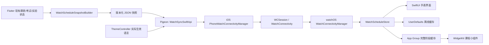
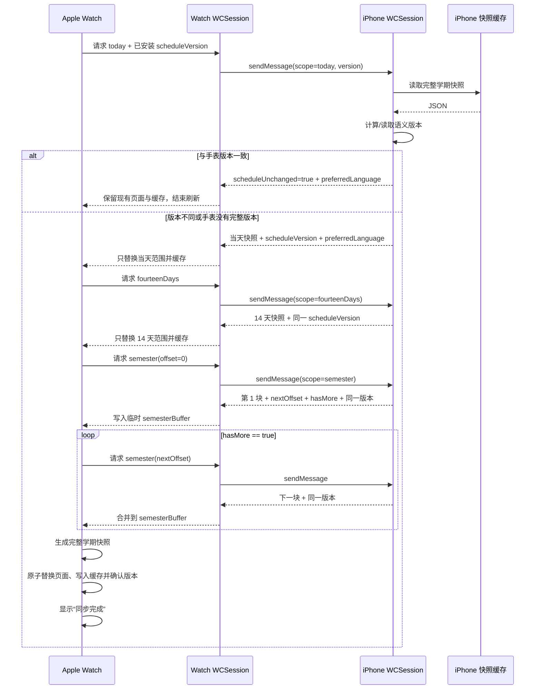
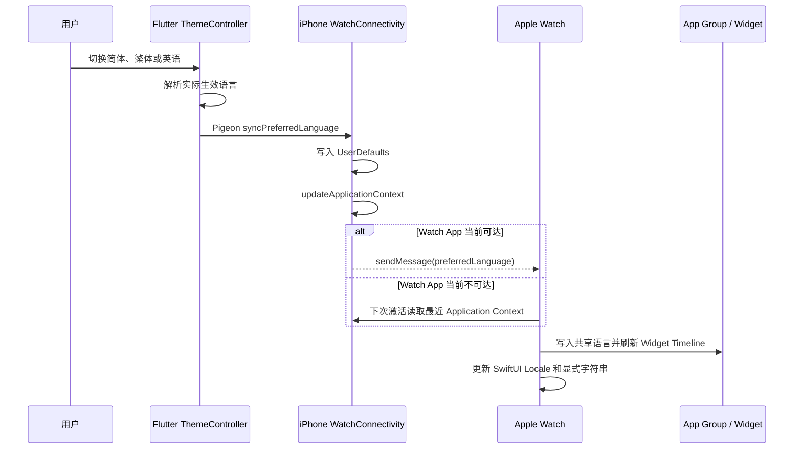

# Apple Watch 版本技术说明

本文面向 Traintime PDA 原维护者，用于快速说明 Apple Watch 版本增加了什么、为什么采用当前架构，以及 iPhone 与 Apple Watch 之间如何完成课表同步。

## 一分钟概览

本次改动没有把 Flutter 应用直接运行在手表上，而是新增了一个原生 SwiftUI watchOS Companion App。

整体设计遵循以下原则：

- iPhone 仍然是唯一的数据源；
- Flutter 负责整合课程、考试、实验、周次和提醒配置；
- Flutter 还负责把手机当前实际生效的界面语言同步给手表；
- iOS 原生层负责保存快照和语言状态，并通过 `WatchConnectivity` 响应手表；
- Apple Watch 只负责同步、缓存和展示；
- 手机不可达时，手表继续显示本地缓存；
- 每次刷新按“当天 → 近 14 天 → 全学期”渐进更新，不阻塞现有页面。
- 手表请求只携带已完整安装的课表版本号；版本未变化时不重复传输 JSON。



## 改动范围

这次新增主要分为三部分：

1. 手机端新增手表数据生产和通信能力；
2. 新增完整的原生 watchOS 应用；
3. 新增读取同一份手表缓存的 WidgetKit 课程小组件。

原有手机业务仍负责获取学校数据。本次没有在手表端重复登录学校系统，也没有让手表直接发起校园接口请求。

---

## 手机端新增内容

### 1. 手表专用日程快照

新增文件：

- `lib/repository/watch/watch_schedule_snapshot.dart`

`WatchScheduleSnapshotBuilder` 会把现有的多种业务模型统一转换为手表可以直接显示的具体日程：

- 普通课程；
- 自定义课程；
- 考试；
- 物理实验；
- 其他实验。

手机端会先把课程周次展开为具体日期，再输出绝对开始和结束时间。这样手表不需要理解 Flutter 侧复杂的课表、周次和课程来源模型。

快照还包含：

- 学期开始日期；
- 手机同步的当前周次；
- 快照生成时间；
- 数据有效范围；
- 时区偏移；
- 上课提醒提前时间；
- 与手机一致的课程颜色。

快照使用 `schemaVersion` 标记协议版本。手表当前接受版本 1 至 4。

### 2. 自动同步服务

新增文件：

- `lib/repository/watch/watch_schedule_sync_service.dart`

`WatchScheduleSyncService` 监听以下状态：

- 课表；
- 学期开始时间；
- 当前周次；
- 考试；
- 物理实验；
- 其他实验；
- 上课提醒配置。
- 手机当前实际生效的语言。

任一数据变化后，服务会使用约 400 毫秒防抖重新生成完整学期快照，再提交到 iOS 原生层。

语言使用 `ThemeController.localeIdentifierSignal` 建立响应式依赖。选择“跟随系统”时，手机会先把系统语言解析成明确的 `zh_CN`、`zh_TW` 或 `en_US`，再发送给原生层。语言同步与课表是否存在解耦：即使用户尚未获得课表，切换语言仍然会更新 Apple Watch。

该服务只在 iOS 上运行，并由 `lib/main.dart` 启动。Android 和其他平台不会执行手表同步逻辑。

### 3. Pigeon 接口扩展

修改入口：

- `pigeon_bridge/save_to_groupid.dart`

新增接口：

```dart
class WatchSchedulePayload {
  String json;
}

@HostApi()
abstract class WatchSyncSwiftApi {
  @async
  bool syncPreferredLanguage(String localeIdentifier);

  @async
  bool syncSchedule(WatchSchedulePayload payload);

  @async
  bool clearSchedule();
}
```

生成文件：

- `lib/bridge/save_to_groupid.g.dart`
- `ios/Runner/SaveToGroupID.g.swift`

调用关系如下：

```text
WatchScheduleSyncService
    → WatchSyncSwiftApi
    → WatchSyncApiImplementation
    → PhoneWatchConnectivityManager
```

Pigeon 生成文件不应手动维护。修改接口后应从 `pigeon_bridge/save_to_groupid.dart` 重新生成。

### 4. iOS WatchConnectivity 管理器

新增文件：

- `ios/Runner/WatchConnectivityManager.swift`

`PhoneWatchConnectivityManager` 负责：

- 激活 iPhone 侧 `WCSession`；
- 接收 Flutter 提交的完整学期 JSON；
- 接收并规范化 Flutter 提交的实际语言；
- 在 iPhone 的 `UserDefaults` 中保留最近快照；
- 在 iPhone 的 `UserDefaults` 中保留最近语言；
- 通过 `updateApplicationContext` 发布最近可用的 14 天数据；
- 通过 Application Context 持久发布语言状态；
- 手表当前可达时，通过即时消息立即发布语言；
- 响应 Apple Watch 的即时请求；
- 按当天、14 天或全学期范围过滤数据；
- 将完整学期拆成小块传输；
- 为完整课表生成稳定的语义版本号，并对相同版本返回轻量确认。

完整学期默认每块发送 50 条日程，避免单条 WatchConnectivity 消息过大。

语义版本号由规范化后的完整快照计算：JSON 重新按键排序后使用 SHA-256，
仅排除每次构建都会变化、但不影响展示内容的 `generatedAtEpochMs`。课程、
考试、实验、周次、提醒、颜色或时间发生变化时都会得到新版本。这样手机
即使重新启动，也能判断手表已有数据是否真的需要重传。

每个课表请求回复也会携带当前语言。这样即使手表错过了语言即时消息，也能在下一次自动刷新或手动刷新时自动修正界面语言。

`ios/Runner/AppDelegate.swift` 增加了两项初始化：

- 应用启动时激活 `PhoneWatchConnectivityManager`；
- Flutter Engine 建立后注册 `WatchSyncSwiftApi`。

### 5. Xcode 工程扩展

Xcode 工程新增：

- `TraintimeWatch` watchOS Target；
- `TraintimeWatchWidgetExtension` Widget Extension Target；
- `TraintimeWatch` Shared Scheme；
- watchOS Swift 源文件；
- WidgetKit Swift 源文件；
- Watch AppIcon Asset Catalog；
- iPhone、Watch App 与 Widget Extension 的依赖和嵌入关系。

签名、Development Team、Bundle Identifier 和 App Group 属于发布环境配置，不属于通信协议本身。合并前应由维护者按原项目的开发者账号和标识符统一确认。

---

## Apple Watch 新增内容

### 1. 原生 SwiftUI 应用

新增目录：

- `watchOS/`

应用入口：

- `watchOS/TraintimeWatchApp.swift`

手表端采用 SwiftUI，而不是 Flutter，主要原因是：

- 可直接使用 watchOS 原生导航和数码表冠；
- 更容易适配不同尺寸 Apple Watch；
- 能使用 watchOS 的液态玻璃按钮样式；
- 不需要在手表上引入另一套 Flutter 运行时；
- 与 `WatchConnectivity`、应用生命周期和本地缓存衔接更直接。

### 2. 数据模型

新增文件：

- `watchOS/Models/WatchScheduleSnapshot.swift`

核心模型：

- `WatchScheduleSnapshot`：一次同步范围内的完整快照；
- `WatchCourse`：统一表示课程、考试或实验；
- `WatchScheduleScope`：表示 `today`、`fourteenDays`、`semester` 三个同步阶段。

Swift 端使用 `Codable` 解码手机生成的 JSON。

### 3. 状态和缓存

新增文件：

- `watchOS/Storage/WatchScheduleStore.swift`

`WatchScheduleStore` 是手表端中心状态仓库，基于 `ObservableObject` 和 `@Published`，负责：

- 当前显示的快照；
- 手机同步的实际语言；
- 当前同步阶段；
- 同步错误；
- 是否正在刷新；
- 同步完成提示；
- 全学期分块合并；
- 本地缓存读取和写入。

手表分别保存三个缓存：

| 缓存 | 内容 |
| --- | --- |
| `today` | 当天日程 |
| `fourteenDays` | 当天起 14 天日程 |
| `semester` | 完整学期日程 |

启动时优先选择：

1. 有效的完整学期缓存；
2. 有效的 14 天缓存；
3. 有效的当天缓存；
4. 如果都过期，则显示最近一次缓存。

同步开始时不会清空已有缓存。只有一个阶段完整解码成功后，才替换当前页面数据并持久化该阶段缓存：

- `today` 完成后只替换当天覆盖的日期范围，其他日期保持原样；
- `fourteenDays` 完成后只替换对应 14 天范围，范围外数据保持原样；
- `semester` 的中间分块只写入内存缓冲区，最后一块校验、编码成功后才原子替换完整学期。

手表只有在完整学期全部安装成功后才持久化 `scheduleVersion`。如果在当天或
14 天阶段就写入版本号，中途断线会让一份局部缓存被误认为完整课表。若完整
学期缓存损坏或丢失，Store 也会主动清除孤立版本号，避免手机错误返回“无需更新”。

### 4. watchOS 通信管理器

新增文件：

- `watchOS/Connectivity/WatchConnectivityManager.swift`

它负责：

- 激活 Watch 侧 `WCSession`；
- 应用进入活动状态后自动刷新；
- 从即时消息、Application Context 和课表回复中安装语言；
- 发起当天、14 天和全学期请求；
- 处理手机返回的 JSON；
- 逐块接收并合并完整学期；
- 在请求中仅携带已安装版本号，并处理“不变更”轻量回复；
- 保证同一轮三个阶段属于同一个手机课表版本；
- 手机不可达时读取最近 Application Context；
- 处理连接超时和错误。

### 5. 手表界面

主要文件：

- `watchOS/Views/RootScheduleView.swift`
- `watchOS/Views/WeekScheduleView.swift`
- `watchOS/Views/CourseRow.swift`

新增视图：

- 下一节课；
- 课程列表；
- 日视图；
- 周视图；
- 周视图课程详情。

界面特性：

- 课程颜色与手机端一致；
- 同时展示课程、考试和实验；
- 显示教室、教师和考试座位号；
- 课程时间统一使用 24 小时制；
- 周视图显示第几周和 1 至 10 节课；
- 点击周视图色块后，在根视图最顶层从底部弹出详情；
- 日视图只用于浏览，不打开详情；
- 日视图和周视图支持左右滑动切换相邻日或相邻周，并保留既有学期边界与触觉；
- 页面切换和刷新按钮使用 watchOS 原生液态玻璃样式；
- 数码表冠滚动时隐藏浮动按钮；
- 日、周和详情页分别把表冠输入映射为滚动、翻页或边界回弹；
- 同步在后台执行，刷新图标显示旋转动画；
- 全部阶段完成后显示非阻塞的同步完成提示。

### 6. 视图职责与函数化边界

本轮代码审计将交互状态、页面语义和绘制内容拆开，方便后续维护时只修改
一个层级。该重构不改变现有 frame、padding、spacing、颜色、动画或表冠阈值：

- `RootScheduleView` 负责页面切换、刷新控件和根级课程详情覆盖层；
- `WeekScheduleView` 只负责周网格、周切换和把选中的课程写回根视图；
- `DayScheduleView` 负责日内滚动、边界回弹和切日规则；
- `CourseDetailView` 负责详情内容、随内容滚动的关闭按钮及原生表冠滚动；
- `WatchCrownTurnSession` 只识别一次连续表冠操作、方向和剩余刻度，不决定页面阈值、动画或触觉类型；
- `WatchConnectivityManager` 只编排通信阶段，`WatchScheduleStore` 负责解码、合并、缓存和发布状态。

课程详情使用根级覆盖层而不是子视图 Sheet。打开时把课程写入根视图的
`selectedCourse`，关闭时直接置空，因此不会遗留系统自动生成的第二个关闭
按钮。详情内容由原生 ScrollView 同时处理手指、表冠和边界皮筋，关闭按钮
属于同一滚动内容。关闭时先释放详情滚动焦点，待退出转场结束后再把焦点
交还周视图，避免实体 Apple Watch 上两个 Crown/Scroll 响应器同时抢占。

维护布局时应继续把尺寸与间距留在对应 View 中。通信、缓存或表冠状态机的
重构不应顺带修改视觉常量；若确需改布局，应作为独立改动通过真机和多尺寸
模拟器截图验证。

### 7. 国际化与语言同步

主要文件：

- `lib/controller/theme_controller.dart`
- `watchOS/Localizable.xcstrings`
- `watchOS/Shared/WatchWidgetShared.swift`
- `watchOS/TraintimeWatchApp.swift`

手表界面支持简体中文、繁体中文和英语。手机 App 内的语言设置是手表界面的首选语言来源，不要求 Apple Watch 的系统语言与手机 App 设置一致。同步后的语言会写入 App Group，Watch App 和 Widget Extension 共用同一状态。

SwiftUI 根视图通过 `.environment(\.locale, ...)` 更新日期和星期格式。切换页目录、“第 N 周”等显式生成的字符串则通过 `watchLocalizedString` 按同步语言直接读取：

- `en.lproj`；
- `zh-Hant.lproj`；
- String Catalog 的简体中文源键。

这里不能只依赖 `String(localized:locale:)`：它的 `locale` 主要参与插值格式化，Bundle 仍可能按照手表系统语言选择资源。例如手机 App 使用英语而手表系统使用中文时，仅传入 Locale 可能仍得到中文目录。

语言同步只改变手表界面文字、日期和星期格式。课程、考试和实验的业务名称来自手机端教务数据，不做机器翻译或字面转换。

### 8. Smart Stack 课程小组件

主要文件：

- `watchOS/Shared/WatchWidgetShared.swift`
- `watchOS/Widget/TraintimeScheduleWidget.swift`
- `watchOS/Widget/TraintimeWatchWidgetBundle.swift`

小组件不会访问手机或校园接口，而是读取 Watch App 在 App Group 中写入的
完整阶段缓存。它会：

- 显示当前课程；当前无课时显示下一节；
- 当前和下一节同时存在时提供切换按钮；
- 显示 24 小时制时间和地点；
- 在右侧显示包含周六、周日的 5×7 点阵；
- 将点阵宽度限制为组件总宽度的四分之一；
- 在课程开始和结束时间建立 Timeline 节点；
- 与 Watch App 共用手机同步的语言设置；
- 所有缓存过期时继续显示最后生成的一份离线数据。

---

## 手机与手表如何通信

### 使用的 WatchConnectivity 通道

当前使用两类通道：

#### `sendMessage`

用于手表能够即时连接手机时的请求/响应。

适合：

- 手表打开应用后主动请求；
- 手动刷新；
- 按范围获取最新数据；
- 全学期分页传输；
- 手机切换语言后立即通知当前可达的手表。

要求 `session.isReachable == true`。

#### `updateApplicationContext`

由手机发布最近一次可用的 14 天数据、对应课表版本和当前语言。

适合：

- 手机暂时不可达时兜底；
- 手表稍后启动时读取最近上下文；
- 即时请求失败时恢复部分可用数据；
- 手表稍后启动时恢复手机最后设置的语言。

Application Context 只保留最新状态，不用于传输全学期分页。手表已经完整
安装相同 `scheduleVersion` 时会跳过 14 天 JSON 解码；版本不同则先把这份
14 天数据按范围合入当前页面，再启动正常的“当天 → 14 天 → 学期”刷新。
语言可以独立于课表存在，因此首次登录前的上下文也可能只包含
`preferredLanguage`。

### 消息字段

iPhone 和 Apple Watch 使用以下固定 Key：

| Key | 类型 | 作用 |
| --- | --- | --- |
| `requestSchedule` | `Bool` | 表示手表请求日程 |
| `scheduleScope` | `String` | `today`、`fourteenDays` 或 `semester` |
| `scheduleOffset` | `Int` | 完整学期当前请求偏移 |
| `scheduleNextOffset` | `Int` | 下一块起始偏移 |
| `scheduleHasMore` | `Bool` | 是否还有后续分块 |
| `scheduleJSON` | `String` | 当前范围的快照 JSON |
| `scheduleVersion` | `String` | 完整学期课表的语义版本；请求端只发送版本号，不发送课表正文 |
| `scheduleUnchanged` | `Bool` | 版本一致的轻量确认；为 `true` 时回复不包含 `scheduleJSON` |
| `preferredLanguage` | `String` | `zh_CN`、`zh_TW` 或 `en_US` |

### 一次完整刷新的时序



如果三个阶段之间手机课表版本发生变化，Watch 端会丢弃尚未完成的学期
缓冲，并从 `today` 重新开始。这样不会把两个版本的课程拼接进同一份缓存。
当天和 14 天每一步成功后会立即更新各自日期范围；未覆盖日期继续显示同步
前缓存，失败也不会清空原页面。

### 一次语言切换的时序



### 手机不可达时

如果 `session.isReachable == false`：

1. 手表尝试读取 `receivedApplicationContext`；
2. 如果存在有效 JSON，则展示 Application Context 数据；
3. 如果没有，则继续保留手表本地缓存；
4. 页面不会因为同步失败被清空；
5. 用户只会看到非阻塞错误提示。

---

## 数据协议

`preferredLanguage` 不属于 `WatchScheduleSnapshot`。它是独立的轻量设置状态，避免只切换语言时重新生成或传输整学期 JSON。

### `WatchScheduleSnapshot`

| 字段 | 说明 |
| --- | --- |
| `schemaVersion` | 快照协议版本 |
| `generatedAtEpochMs` | 手机生成快照的时间 |
| `semesterStartEpochMs` | 学期开始日期 |
| `currentWeekIndex` | 手机同步的零基周次 |
| `validThroughEpochMs` | 当前快照有效期 |
| `rangeStartEpochMs` | 数据范围开始 |
| `rangeEndEpochMs` | 数据范围结束 |
| `timeZoneOffsetMinutes` | 手机时区偏移 |
| `reminderMinutes` | 上课前提醒分钟数 |
| `courses` | 具体日程数组 |

### `WatchCourse`

| 字段 | 说明 |
| --- | --- |
| `id` | 可跨分块去重的稳定标识 |
| `name` | 课程、考试或实验名称 |
| `teacher` | 教师，可为空 |
| `classroom` | 教室或考场，可为空 |
| `startAtEpochMs` | 开始时间 |
| `endAtEpochMs` | 结束时间 |
| `startSection` | 开始节次 |
| `endSection` | 结束节次 |
| `colorARGB` | 与手机一致的颜色 |
| `kind` | `course`、`exam`、`physicsExperiment`、`otherExperiment` |
| `note` | 考试座位号或实验附加信息 |

---

## 关键文件索引

| 文件 | 作用 |
| --- | --- |
| `lib/controller/theme_controller.dart` | 解析手机实际生效语言并暴露语言 Signal |
| `lib/repository/watch/watch_schedule_snapshot.dart` | 把手机业务模型转换为手表快照 |
| `lib/repository/watch/watch_schedule_sync_service.dart` | 监听业务数据和语言并自动向 iOS 提交 |
| `pigeon_bridge/save_to_groupid.dart` | 定义 Flutter 到 Swift 的同步接口 |
| `ios/Runner/WatchConnectivityManager.swift` | iPhone 侧快照/语言缓存、过滤和通信 |
| `watchOS/Connectivity/WatchConnectivityManager.swift` | Watch 侧渐进式同步和语言接收 |
| `watchOS/Storage/WatchScheduleStore.swift` | Watch 状态、课表缓存、语言和分块合并 |
| `watchOS/Models/WatchScheduleSnapshot.swift` | Watch 侧 Codable 模型 |
| `watchOS/Shared/WatchWidgetShared.swift` | Watch App 与小组件的课表/语言共享缓存 |
| `watchOS/Localizable.xcstrings` | Watch App 与 Widget 的三语 String Catalog |
| `watchOS/TraintimeWatchApp.swift` | 注入 Store 和手机同步的 SwiftUI Locale |
| `watchOS/Views/RootScheduleView.swift` | 根页面、刷新和页面切换 |
| `watchOS/Views/WeekScheduleView.swift` | 列表、日视图和周视图 |
| `watchOS/Views/CourseRow.swift` | 课程行和课程详情 |
| `watchOS/Widget/TraintimeScheduleWidget.swift` | 当前/下一节课程 Smart Stack 小组件 |
| `watchOS/Assets.xcassets` | Apple Watch AppIcon |

---

## 构建与验证

### 静态审计

不启动模拟器即可先检查本轮 Swift 重构的语法和差异格式：

```bash
swiftc -parse \
  watchOS/Views/RootScheduleView.swift \
  watchOS/Views/WeekScheduleView.swift \
  watchOS/Views/CourseRow.swift \
  watchOS/Connectivity/WatchConnectivityManager.swift \
  watchOS/Storage/WatchScheduleStore.swift

git diff --check
```

`swiftc -parse` 只检查语法，不替代 Xcode 的 SDK 类型检查、Target Membership、
签名和嵌入验证，因此仍必须继续执行下面的双端构建。

### Dart 快照测试

```bash
.flutter/bin/flutter test test/watch_schedule_snapshot_test.dart
```

覆盖内容包括：

- 只展开有效周次课程；
- 自定义课程；
- 考试和座位号；
- 实验；
- 非正同步范围拒绝；
- 同科目同时间、不同座位考试的 ID 去重保护；
- 当前周次和学期起始时间；
- JSON 协议字段。

当前测试文件共包含 6 项测试。语言资源属于原生 watchOS 层，应同时通过编译产物中的 `en.lproj` 和 `zh-Hant.lproj` 检查目录、周次标题等关键字符串。

### watchOS 构建

```bash
xcodebuild \
  -workspace ios/Runner.xcworkspace \
  -scheme TraintimeWatch \
  -configuration Debug \
  -destination 'generic/platform=watchOS Simulator' \
  CODE_SIGNING_ALLOWED=NO \
  build
```

### 完整 iPhone + Watch Companion 构建

验证真机 SDK、Runner 与 Watch Companion 的嵌入关系：

```bash
xcodebuild \
  -workspace ios/Runner.xcworkspace \
  -scheme Runner \
  -configuration Debug \
  -destination 'generic/platform=iOS' \
  -allowProvisioningUpdates \
  build
```

Flutter 检测到 Watch Companion App 后，模拟器构建必须指定一个已与 Watch 模拟器配对的 iPhone 模拟器 UDID：

```bash
.flutter/bin/flutter devices

.flutter/bin/flutter build ios \
  --simulator \
  --debug \
  -d <PAIRED_IPHONE_SIMULATOR_UDID>
```

真机测试还需要：

- iPhone 和 Apple Watch 已配对；
- 两台设备开启开发者模式；
- Runner、Widget 和 Watch Target 使用匹配的签名团队；
- Watch App 的 Companion Bundle Identifier 指向 Runner；
- 使用实际开发者账号可用的 App Group。

---

## 当前限制与后续建议

### 1. 提醒仍由 iPhone 负责

当前手表主要依赖 iPhone 本地通知自动转发到 Apple Watch。

没有额外建立手表本地通知调度器，避免手机和手表同时触发造成重复提醒。如果未来需要手表脱离手机独立提醒，应先增加“通知责任端”设置。

### 2. 手表不直接登录校园系统

这是有意的架构选择。登录凭据、接口兼容、验证码和数据合并仍由手机处理。手表保持只读、轻量和离线可用。

### 3. 全学期数据依赖手机快照

手机必须至少成功生成过一次完整学期快照。之后即使手机暂时不在线，手表也能继续使用自己的完整缓存。

### 4. Schema 升级需要双端兼容

新增、删除或改变快照字段时，需要同步修改 Dart 和 Swift 模型，并提升 `schemaVersion`。对于可选新增字段，优先保持向后兼容。

### 5. Bundle 与签名配置需要维护者复核

开发过程中的个人 Team、Bundle Identifier 和 App Group 不能直接作为正式发布配置。合并时应统一回到项目现有的开发者账号和应用标识体系。

### 6. 课程名称不属于界面本地化

手表的目录、状态、日期、星期、课程类型和同步提示支持三语切换；具体课程、考试和实验名称来自学校或用户数据，当前保持原文。若未来需要翻译业务数据，应在手机数据层增加明确的多语言字段，而不是在手表端根据名称猜测或机器翻译。

---

## 建议维护者优先审查

如果只做一次快速 Code Review，建议按以下顺序：

1. 检查 `WatchScheduleSnapshotBuilder` 是否正确映射现有课程、考试和实验模型；
2. 检查 Pigeon 接口是否符合项目现有原生桥接规范；
3. 检查 iPhone 与 Watch 两端的消息 Key 和范围语义是否完全一致；
4. 检查语言 Signal、`preferredLanguage` 和 App Group 语言缓存链路；
5. 检查三级缓存是否满足离线和失败回退预期；
6. 检查 Xcode Target、嵌入关系、Bundle Identifier 和 App Group；
7. 最后审查 SwiftUI 页面布局、国际化和交互。

核心结论是：本次实现没有改变手机端作为数据源和界面语言来源的职责，而是在现有 Flutter 业务数据之上增加了一层手表专用快照与轻量设置同步，通过 Pigeon 和 WatchConnectivity 把它们交给一个原生、可缓存、渐进同步且支持三语界面的 SwiftUI watchOS 应用。
