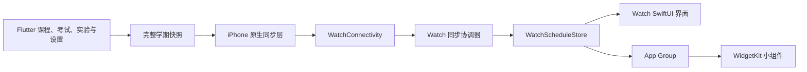
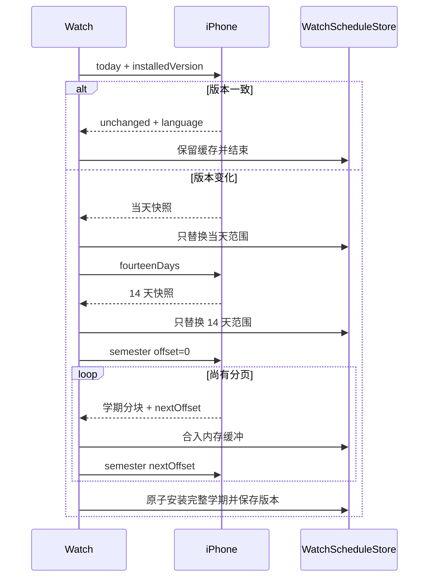

# XDYou Apple Watch 技术说明

## 总体架构

Apple Watch 功能采用 **iPhone 主数据源 + 原生 watchOS Companion App**
架构。手机负责登录、访问校园系统、合并业务数据和生成课表；手表不保存账号
凭据，也不直接访问学校接口，只展示手机已经展开到具体日期和时间的日程。



系统分为五层：

1. **Flutter 业务层**：课程、自定义课程、考试、实验、学期、周次、提醒和
   App 语言的唯一事实来源；
2. **快照层**：把重复课表展开成带绝对起止时间、节次、颜色和类型的完整
   学期 JSON；
3. **iPhone 通信层**：保存最新完整快照、计算语义版本，并按手表请求裁剪
   当天、近 14 天或学期分页；
4. **Watch 状态层**：负责三阶段同步、校验、范围合并、持久化和派生索引；
5. **展示层**：Watch App 与 Widget 只读取已经校验并安装的数据。

数据单向流动。手表发往手机的内容只有同步请求、范围、分页偏移、请求标识和
已完整安装的版本号，不会回传本地完整课表。

## 数据归属与模块边界

| 数据或状态 | 写入方 | 读取方 |
| --- | --- | --- |
| 原始课程、考试、实验与设置 | Flutter | 快照构建层 |
| 完整学期快照与语义版本 | iPhone 原生层 | Watch 通信层 |
| 当前可见课表与三级缓存 | `WatchScheduleStore` | Watch 各视图 |
| 排序、按日分组和五段课程 ID 索引 | `WatchScheduleStore` | 列表、日、周、月视图 |
| 月份网格和三页预热窗口 | `MonthCalendarCache` | 月视图 |
| 日视图卡片高度 | `DayCourseLayoutTracker` | 日视图纵向导航 |
| 页面位移、表冠会话和吸附状态 | 对应 SwiftUI View | 仅对应页面 |
| Widget 课表、语言与交互状态 | App Group | Widget Extension |

主要目录：

| 路径 | 职责 |
| --- | --- |
| `lib/repository/watch/` | 构建完整学期快照并监听手机数据变化 |
| `ios/Runner/WatchConnectivityManager.swift` | iPhone 快照、版本、范围裁剪与回复 |
| `ios/Runner/PhoneWatchQueuedScheduleTransport.swift` | 后台队列请求转发与关联 |
| `watchOS/Connectivity/WatchConnectivityManager.swift` | Watch 三阶段同步状态机 |
| `watchOS/Storage/WatchScheduleStore.swift` | 快照安装、缓存、索引和公开状态 |
| `watchOS/Shared/WatchWidgetShared.swift` | App Group、语言、缓存键和通用编码 |
| `watchOS/Views/RootScheduleView.swift` | 顶层路由、提示、悬浮控件和详情层 |
| `watchOS/Views/OverviewScheduleView.swift` | 当前或下一节课程概览 |
| `watchOS/Views/CourseListView.swift` | 整学期自然日分组列表 |
| `watchOS/Views/DayScheduleView.swift` | 单日课程、纵向浏览与横向翻日 |
| `watchOS/Views/WeekScheduleView.swift` | 周次边界、七日网格与色块命中 |
| `watchOS/Views/MonthScheduleView.swift` | 月份网格、日程标记与日期提交 |
| `watchOS/Views/MonthCalendarData.swift` | 月份轻量模型、标记组装和三页内存缓存 |
| `watchOS/Views/CourseViews.swift` | 共用课程卡片和顶层详情页 |
| `watchOS/Views/CalendarPagingSupport.swift` | 日/周/月共用分页、吸附和表冠桥接 |
| `watchOS/Views/InteractionAwareScrollView.swift` | 列表滚动观察和顶部保护 |
| `watchOS/Views/WatchInteractionSupport.swift` | 触觉反馈和表冠连续会话 |
| `watchOS/Widget/` | Smart Stack 小组件 |

通信层不保存 SwiftUI 页面状态，View 不直接解析 WatchConnectivity 字典；
Store 不持有页面手势和动画状态。

## 手机端课表生产

### 完整快照

Flutter 将以下内容转换为统一的 `WatchCourseOccurrence`：

- 学校课程；
- 自定义课程；
- 考试及座位号；
- 物理实验和其他实验；
- 学期起点、当前周次和数据覆盖范围；
- 时区、提醒提前时间和与手机端一致的课程颜色。

日程类型包括 `course`、`exam`、`physicsExperiment` 和
`otherExperiment`。当前快照 schema 为 4，Watch App 与 Widget 共同使用
`WatchWidgetShared.supportedScheduleSchemaVersions` 校验支持范围。

### 语义版本

iPhone 对规范化后的完整学期快照计算 SHA-256。生成时间等不影响展示的临时
字段不参与版本；课程、日期、节次、颜色、周次、地点、教师或座位发生变化时
会产生新版本。

手表请求携带已完整安装的版本号：

- 版本一致：手机返回 `scheduleUnchanged` 和轻量设置，不发送课表正文；
- 版本不同或手表没有完整版本：执行当天、14 天、学期三阶段同步。

只有完整学期所有分页安装成功后，手表才持久化新版本。局部缓存不能代表完整
课表，因而当天或 14 天阶段不会提前更新版本号。

## 渐进同步

### 阶段顺序



同一轮三个阶段必须属于同一版本。中途版本变化时，Watch 丢弃学期缓冲并从
当天重新开始，避免把两份课表拼接在一起。

### 通信通道

| 通道 | 用途 |
| --- | --- |
| `sendMessage` | 前台可达时的低延迟请求与回复 |
| `transferUserInfo` | 实体表即时失败后的后台队列 |
| `updateApplicationContext` | 最新 14 天快照、版本和语言的启动兜底 |

即时和后台通道共用 iPhone 的回复生成函数，范围过滤、版本判断和分页语义保持
一致。后台回复通过 `refreshID` 与 `requestID` 去重；旧刷新、重复投递和迟到
分页不会覆盖当前数据。

### 启动与离线

Watch App 每次打开或回到前台都会请求同步：

- 3 秒内没有手机回复且存在有效学期缓存：继续展示缓存，并显示可轻点关闭、
  15 秒自动消失的紧凑提示；
- 没有任何可展示学期日程：显示“请打开手机 XDYou”页面；
- 同步阶段失败或超时：保留原页面和原缓存；
- 每个阶段成功后立即替换该阶段覆盖范围，不清除范围外日期。

## 持久化缓存

缓存按数据生命周期拆分，不能简单合成一个大对象。课表正文需要阶段级原子
替换；派生索引可重建；卡片高度还受语言和表盘宽度影响。分层存储能让单项
损坏只触发该层重建。

### 缓存清单

| 缓存 | 存储位置 | 内容 | 失效或重建条件 |
| --- | --- | --- | --- |
| 当天课表 | Standard + App Group | 当天完整快照 | 新当天阶段完成 |
| 近 14 天课表 | Standard + App Group | 14 天完整快照 | 新 14 天阶段完成 |
| 完整学期课表 | Standard + App Group | 权威学期快照 | 学期全部分页完成 |
| 已安装版本 | Standard | iPhone 语义版本 | 完整学期缺失或新学期安装 |
| 展示派生索引 | Standard | 排序 ID、自然日分组、五段标记、列表入口 | 来源快照不匹配或 schema 变化 |
| 日卡片布局 | Standard | 课程 ID 到实测卡片高度 | 课表版本、语言或表盘宽度变化 |
| 月份预热窗口 | 运行时内存 | 当前月前、中、后三页网格与标记 | 课表索引变化或浏览到新月份 |
| Widget 交互状态 | App Group | 当前/下一节切换状态 | 用户操作或时间线更新 |

私有缓存键统一定义在 `WatchPersistentCacheKey`；Codable Data 的编码和读取统一
经过 `WatchCacheCoding`。课表正文的三个共享键及其优先级由
`WatchWidgetShared` 唯一维护，Store 与 Widget 不再各自复制键名或 schema
范围。

### 原始课表恢复

启动时 Store 按“学期 → 14 天 → 当天”读取缓存。每个范围会依次尝试 Watch
标准 Defaults 与 App Group：

1. 任一来源解码失败只忽略该条，继续检查另一个来源；
2. 旧版本只有标准缓存时，会把有效 JSON 迁移到 App Group；
3. 完整学期存在时始终优先，包括已经结束的历史课程；
4. 尚无完整学期时，优先仍有效且包含日程的短范围缓存，再回退到最新缓存；
5. 存在版本号但完整学期缓存丢失时清除孤立版本，防止误报“无需更新”。

### 持久化派生索引

`WatchScheduleStore` 在快照安装时一次生成：

- 稳定排序后的课程数组；
- `Date -> [WatchCourse]` 自然日索引；
- 课程列表分组和首次定位日期；
- `courseID -> WatchCourse` 映射；
- 每日五个两节区间对应的课程 ID。

新建和恢复最终都经过 `installVisibleScheduleIndex`，确保所有派生字段原子安装。
持久化索引包含来源快照身份，只有 schema、生成时间、范围和课程数量全部匹配
才会复用；否则由原始快照重建。iPhone 的语义版本仍是“课表是否变化”的唯一
依据，来源身份仅防止本地文件错配。

恢复流程按职责拆分：先校验缓存与原始快照身份，再恢复课程 ID 和自然日索引，
最后恢复课程列表入口。跨自然日时只重算列表入口；任一结构校验失败则整体回退
到原始课表重建，不安装部分索引。

### 月视图运行时预热

`MonthCalendarCache` 管理两类生命周期不同的数据：

- 日期网格只由年月决定，可跨课表版本复用；
- 五段标记引用当前课表课程，课表索引变化时单独失效。

Store 恢复派生索引后立即预热当前月及前后两月。日视图选择日期变化时预热该
日期对应的三页窗口；月视图只接收已经成组准备好的日期模型和标记字典。页面
入场、横向拖动和表冠逐帧路径因此只读取内存，不执行整学期扫描、颜色转换或
持久化编码。

### 日视图布局缓存

日视图使用课程真实卡片高度把连续课程索引换算成像素位移。高度缓存签名包含：

- 已安装课表版本；没有版本时使用当前快照结构身份；
- 手机同步的界面语言；
- 当前表盘内容宽度；
- 布局缓存 schema。

相邻三页预先测量卡片，测量结果先合并到内存。手指或表冠逐帧操作期间暂停
JSON 编码，停止交互后延迟合并写盘，避免磁盘工作占用动画帧。

## Watch App 界面

三点按钮提供五种模式：

1. **概览**：显示正在进行的课程，否则显示未来最近一节；
2. **课程列表**：按自然日分组浏览整学期日程；
3. **日视图**：浏览单日课程卡片；
4. **月视图**：浏览月份并选择日期；
5. **周视图**：显示第 1–10 节的七日色块网格。

课程、考试和实验使用手机传来的颜色。列表和日视图使用 24 小时制，地点与
教师或考试座位号同行显示，超出宽度时尾部省略。

### 共用分页基础设施

日、周、月视图复用以下实现：

- `CalendarHorizontalPager`：稳定的前、中、后三页容器和触摸轴锁定；
- `horizontalDragMotion`：按位移、预测位置和末速度决定目标页；
- `calendarCrownPageMotion`：把表冠刻度与速度换算成横向像素；
- `normalizedContinuousPageOffset`：完整跨页后的无动画换底；
- `horizontalPageSnap`：生成目标位置和吸附时间；
- `CalendarPagingCrownInputModifier`：统一表冠范围、步长、灵敏度和系统声音；
- `CalendarCrownIdleCoordinator`：统一 `onIdle` 确认与实体表漏回调兜底。

页面只保留自己的业务差异：日视图的纵向卡片阶段、周视图的学期边界、月视图
的月份模型和日期提交。共享组件不包含课程数据，也不改变页面布局。

### 日视图

- 前一天、当前日和后一天预渲染，横向触摸与页面位移保持 1:1；
- 同一个触摸层先识别横向或纵向，锁定后不再竞争；
- 纵向触摸和表冠共用同一内容偏移与课程索引；
- 多项日程先纵向浏览，达到末项后转入连续横向翻日；
- 零项或一项日程直接横向翻日；
- 触摸松手支持惯性、阻尼、边界回弹和末项安全留白；
- 横向完整跨屏后立即换底，持续旋转表冠可连续翻日；
- 日期标题可打开独立月份页；日视图不打开课程详情。

卡片高度预热和持久化使相邻有课日期进入屏幕前已经具备布局数据；页面偏移
变化不会重新排序课程或查询整学期快照。

### 周视图

- 周标题优先使用手机同步的周次参考；
- 可浏览范围限制在手机完整学期首周与末周；
- 当前日期列使用淡色高亮；
- 手指、标题箭头和表冠共用横向分页；
- 点击色块打开顶层课程详情，点击空白区域恢复悬浮控件；
- 学期边界使用阻尼位移和触觉反馈，不提交无效周次。

### 月视图与日期选择

月视图与日视图日期入口共用 `MonthScheduleView`：

- 页面是根视图中的独立全屏层，从底部进入和退出；
- 星期栏、月份标题和网格属于同一转场；
- 手指、表冠和标题箭头均可翻月；
- 当前月和相邻月份构成轻量三页窗口；
- 单月使用一个异步 Canvas 绘制日期、网格、今天红框和五段标记；
- 点击坐标换算为 7 列日期索引，不创建 35/42 个按钮；
- 普通日期为亮白色，选中日期为蓝色加粗；
- 今天使用透明红色粗框；有日程时红框同时包住日期和五段标记；
- 五段依次代表第 1–2、3–4、5–6、7–8、9–10 节，有课使用课程色，
  空闲段使用暗白色，整天无日程不绘制五段。

### 课程详情与悬浮控件

课程详情位于 `RootScheduleView` 最上层，从底部弹出，不使用系统 Sheet。
内容使用原生 ScrollView，手指和表冠均可滚动；关闭后再把表冠焦点交还周视图。

刷新按钮位于右上方，模式按钮位于右下方。滚动或转动表冠时自动隐藏；等待
手机或正在同步时保持显示。同步完成提示和缓存提示不阻塞页面操作。

## 国际化

Watch App 与 Widget 支持：

- 简体中文 `zh_CN`；
- 繁体中文 `zh_TW`；
- 英语 `en_US`。

手机 App 当前实际生效语言是首选来源。Watch Store 把语言写入 App Group，
App 与 Widget 共用。目录、状态和周次通过 `watchLocalizedString` 读取 String
Catalog；日期与星期使用注入的 Locale。课程、教师和地点属于用户或学校数据，
保持原文。

## Smart Stack 小组件

Widget 只读取 App Group，不访问手机或校园接口：

- 有正在进行的课程时显示当前课程；
- 否则显示下一节课程；
- 当前和下一节同时存在时提供切换按钮；
- 显示 24 小时制时间和地点；
- 右侧显示包含周六、周日的 5×7 点阵，最多占宽度四分之一；
- 在课程开始和结束时间生成 Timeline 节点。

## 通知职责

课程提醒由 iPhone 本地通知系统调度并由系统转发到 Apple Watch。Watch App
不重复创建相同提醒，避免手机和手表同时通知。

## 构建与验证

### Swift 语法和差异检查

```bash
xcrun swiftc -parse \
  watchOS/Shared/WatchWidgetShared.swift \
  watchOS/Storage/WatchScheduleStore.swift \
  watchOS/Connectivity/WatchConnectivityManager.swift \
  watchOS/Views/*.swift

git diff --check
```

### watchOS 无签名构建

```bash
xcodebuild \
  -project ios/Runner.xcodeproj \
  -scheme TraintimeWatch \
  -configuration Debug \
  -destination 'generic/platform=watchOS' \
  CODE_SIGNING_ALLOWED=NO \
  build
```

### Flutter 快照测试

```bash
.flutter/bin/flutter test test/watch_schedule_snapshot_test.dart
```

真机安装还要求 iPhone、Watch App 和 Widget 使用同一开发团队与 App Group，
Watch Companion Bundle Identifier 正确指向 Runner，并在手机和手表上启用
开发者模式。

## 维护规则

修改同步协议时：

1. 同步更新 Dart、iPhone Swift、Watch Swift 与 schema；
2. 验证版本一致、版本变化、分页中途版本变化三条路径；
3. 保证当天和 14 天只替换自己的范围；
4. 只在完整学期安装后保存版本；
5. 不因失败、超时或坏分页清空旧缓存。

修改缓存时：

1. 新缓存必须有 schema 或来源签名；
2. 可重建派生数据不要复制完整课程模型；
3. 动画和表冠逐帧路径不得编码 JSON 或写 UserDefaults；
4. App Group 键、语言和 schema 范围只在共享层定义；
5. 单项缓存损坏必须可以独立回退或重建。

修改界面交互时：

1. 复用分页纯函数和表冠协调器，不复制停止计时逻辑；
2. 保持触摸、表冠和顶部箭头经过同一页面提交入口；
3. 检查 41mm、45mm 和 49mm 表径；
4. 验证周网格色块与空白区域的命中优先级；
5. 验证简体中文、繁体中文和英语；
6. 布局调整与交互重构分开提交，便于定位回归。
