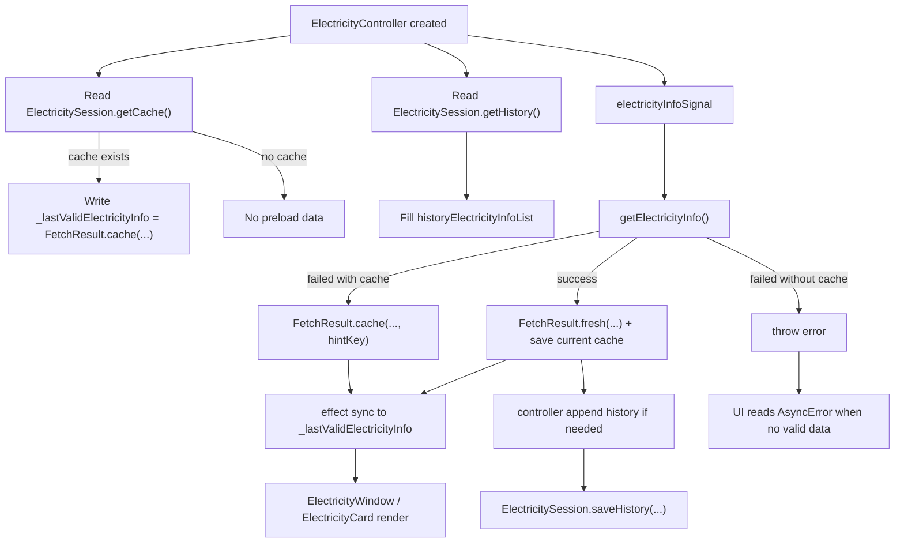

# Electricity State Management

相关代码：

- `lib/repository/xidian_ids/electricity_session.dart`
- `lib/controller/electricity_controller.dart`
- `lib/model/fetch_result.dart`
- `lib/model/xidian_ids/electricity.dart`
- `lib/page/electricity/electricity_window.dart`
- `lib/page/electricity/electricity_ready_view.dart`
- `lib/page/homepage/info_widget/electricity_card.dart`
- `lib/page/public_widget/cache_alerter.dart`
- `lib/page/public_widget/loading_alerter.dart`

## 总览

电费模块当前由三层状态共同决定：

1. 仓库层结果状态：`FetchResult<ElectricityInfo>`；
2. 控制器展示状态：
   - `futureSignal`，用于获取电费信息的一个自管理异步信号；
   - `_lastValidElectricityInfo`：最后一次获取的电费信息，在异步信号修改后由一个 effect 副作用更新；
   - `historyElectricityInfoList`：历史记录信息，在异步信号修改后由一个 effect 副作用更新；
   - 一组由`_lastValidElectricityInfo`派生的`computed`状态。
3. 页面语义状态
   - 详情页 `ElectricityWindow`
   - 首页卡片 `ElectricityCard`

电费当前状态包括：

- 当前请求是否仍在进行；
- 当前是否已有可展示电费数据；
- 当前展示的是 fresh 还是 cache；
- 当前缓存提示应该如何展示；
- 当前历史图表读取的是哪一批余额快照。

## 仓库层

入口函数：

- `getElectricityInfo(...)`

统一返回：

- `FetchResult<ElectricityInfo>`

返回规则：

- 在线抓取成功，即 `FetchResult.fresh(fetchTime: DateTime.now(), data: data)`；
- 在线抓取失败但本地缓存可用，即 `FetchResult.cache(fetchTime: cacheTime, data: cacheData, hintKey: ...)`；
- 在线抓取失败且缓存不可用，继续抛错。

## 数据来源

电费在线数据来源于西电缴费平台，包括以下两步：

1. `loginPayment(...)`：负责自动登录、验证码处理、取得 `addressid` 和 `liveid`；
2. 并发查询电量信息`getElectricity(...)`和欠费信息`getOwe(...)`，两路结果最终组合成一个 `ElectricityInfo`。

## 缓存状态

电费模块当前维护两类缓存文件：

1. 当前电费缓存
   - 文件：`Electricity.json`
   - 读取入口：`ElectricitySession.getCache()`
   - 写入入口：`ElectricitySession.saveCache(info)`
   - 删除入口：`ElectricitySession.removeElectricityInfoCache()`

2. 历史电费缓存
   - 文件：`ElectricityHistory.json`
   - 读取入口：`ElectricitySession.getHistory()`
   - 写入入口：`ElectricitySession.saveHistory(history)`
   - 清空入口：`ElectricitySession.clearElectricityHistory()`

### 当前缓存规则

1. 只有`remain`能成功解析为数字时，`getCache()`才认为缓存有效；
2. 缓存时间直接取自缓存内容里的`fetchDay`；
3. 当前缓存用于构造`FetchResult.cache(...)`，供控制器和 UI 预热展示。

### 历史缓存规则

1. 历史列表只保存`ElectricityInfo`，读取后按`fetchDay`升序排序；
2. 历史写入策略不在仓库层决定，而由控制器层决定何时写入。控制器会给新的历史记录的列表，由仓库层写入。

## 错误到缓存提示的映射

当在线抓取失败但本地缓存存在时，仓库层不会只返回默认缓存提示，而会按错误类型写入`hintKey`。

当前规则：

- `NoAccountInfoException`：`electricity.cache_hint_account_missing`，无密码错误；
- `AccountFailedParseException`：`electricity.cache_hint_account_parse_failed`，无法分析获取的宿舍信息；
- `CaptchaFailedException`：`electricity.cache_hint_captcha_failed`，验证码分析错误；
- `PasswordWrongException`：`electricity.cache_hint_password_wrong`，密码错误；
- `LoginFailedException`，登录错误：
  - 若消息是“验证码校验失败”，则为`electricity.cache_hint_captcha_failed`，
  - 其余情况为`electricity.cache_hint_login_failed`；
- `NotInitalizedException`，未初始化错误：
  - 若消息是“用户名或密码错误”，则为`electricity.cache_hint_password_wrong`，
  - 若消息包含“验证码”，则为`electricity.cache_hint_captcha_failed`，
  - 其余情况为`electricity.cache_hint_login_failed`；
- `DioException`：`electricity.cache_hint_network_failed`，网络错误；
- 其他错误：`electricity.cache_hint_unknown_error`。

## 控制器层

核心字段：

- `electricityInfoSignal`：类型为`futureSignal<FetchResult<ElectricityInfo>>`，承载异步状态；
- `_lastValidElectricityInfo`：类型为`signal<FetchResult<ElectricityInfo>?>`，承载最后一份可展示数据；
- `historyElectricityInfoList`：内存中的历史电费列表。

派生字段：

- `displayElectricityInfo`：需显示的电费信息；
- `hasValidElectricityInfo`：是否有有效电费信息；
- `isElectricityFromCache`：电费信息是否来自内存；
- `electricityFetchTime`：电费获取时间；
- `electricityCacheHintKey`：电费如从缓存获取，缓存附带的解释信息。

## 构造期缓存预热

控制器构造时先做两件事：

1. 读取`ElectricitySession.getCache()`，若缓存存在，立即写入 `_lastValidElectricityInfo`；
2. 读取`ElectricitySession.getHistory()`，载入`historyElectricityInfoList`。

这样页面首次打开时，如果本地已有缓存，可以先展示旧数据和旧图表。

## 历史同步策略

控制器通过一个 effect 监听`electricityInfoSignal.value`，若状态为`AsyncData<FetchResult<ElectricityInfo>>`，同步`_lastValidElectricityInfo`后判断是否需要写历史。

历史写入规则如下所示：

- 只有 `FetchResult.fresh(...)` 才会进入历史；
- 若 `remain` 不能解析为数字，则不写历史；
- 若与历史最后一条同一天且 `remain` 相同，则不重复写入；
- 最多保留约 15 条，超出时移除最早一条；
- 最终由 `ElectricitySession.saveHistory(...)` 执行落盘。

## 刷新状态

`refreshElectricityInfo(...)`依靠`electricityInfoSignal.reload()`函数。当请求重新触发时，signal 会进入加载状态，但控制器不会清空上一次获取的信息`_lastValidElectricityInfo`，因此页面仍可继续显示旧数据，再叠加顶部`LoadingAlerter`。

## 页面语义状态

- `loading`：当前正在加载且没有任何可展示数据；
- `readyFresh`：有可展示数据且当前展示不是缓存；
- `readyCache`：有可展示数据且当前展示来自缓存；
- `fatalError`：当前没有任何可展示数据且有报错`state is AsyncError`。

“请求过程失败但成功回退缓存”在页面语义上属于 `readyCache`，不属于 `fatalError`。

### 详情页 `ElectricityWindow`

详情页同时读取：

1. 异步状态：
   - `electricityInfoSignal.value`；
2. 最后有效结果：
   - `displayElectricityInfo`，
   - `isElectricityFromCache`，
   - `electricityFetchTime`，
   - `electricityCacheHintKey`。

若有可展示数据，通过`ElectricityReadyView`渲染内容。若来自缓存，显示`CacheAlerter`，若当前仍在 loading，叠加`LoadingAlerter`。
若无可展示数据：判断是否报错，如果有报错`state is AsyncError`，显示 `ReloadWidget`，否则显示中间 `CircularProgressIndicator`。

### `ElectricityReadyView`

`ElectricityReadyView` 是详情页的纯展示组件，只接收：

- `displayInfo`：需显示的电费信息；
- `historyElectricityInfo`：历史电费信息；
- `onRefresh`：触发电费更新的回调函数。

### 首页卡片 `ElectricityCard`

首页卡片不直接决定业务状态，只消费控制器状态：

- 若有显示信息，`displayInfo != null`主文案显示剩余电量，底部显示欠费信息或缓存时间。
- 若`displayInfo == null`，回退到 `state.map(...)` 展示 loading / error 文案。

首页卡片的 loading 条只在确实在加载且无可显示数据情况下出现，`state.isLoading == true && displayInfo == null`。也就是说，若控制器里还有旧数据，首页卡片会优先继续显示旧内容，而不会被 loading 条整体替换。

## 数据流

## 典型状态组合

| State | UI |
|---|---|
| loading | 中间 `CircularProgressIndicator` |
| readyFresh | 显示电费内容，不显示缓存提示 |
| readyCache | 显示电费内容 + `CacheAlerter` |
| readyFresh + loading | 显示旧内容 + `LoadingAlerter` |
| readyCache + loading | 显示缓存内容 + `CacheAlerter` + `LoadingAlerter` |
| fatalError | `ReloadWidget` |
