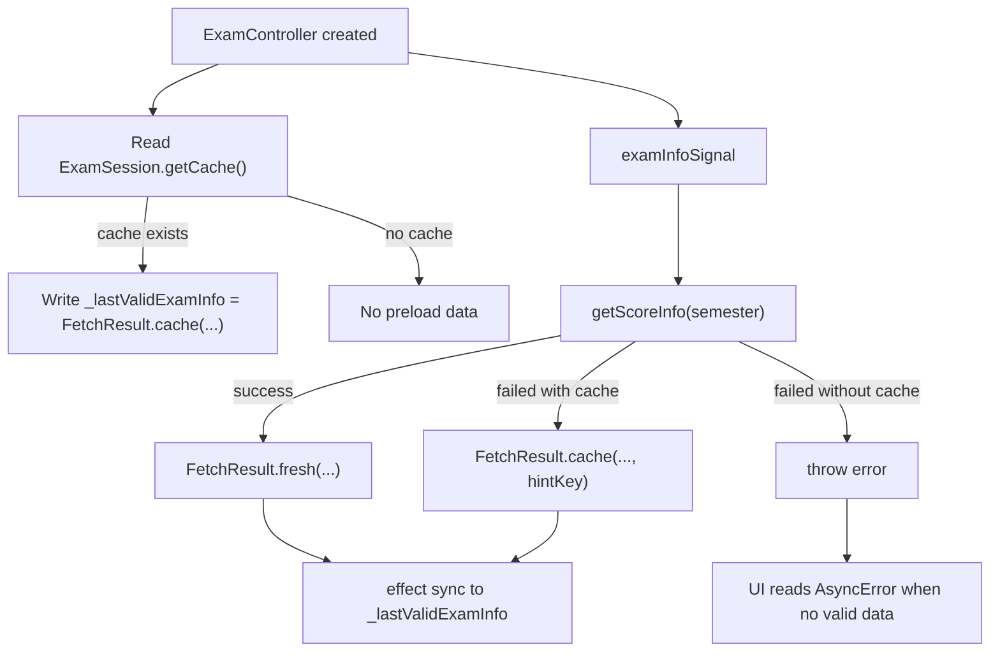

# Exam State Management

相关代码：

- `lib/repository/xidian_ids/exam_session.dart`
- `lib/controller/exam_controller.dart`
- `lib/model/fetch_result.dart`
- `lib/model/xidian_ids/exam.dart`

## 总览

考试信息模块当前由两层状态共同决定：

1. 仓库层结果状态
   - `FetchResult<ExamData>`
2. 控制器展示状态
   - `futureSignal`
   - `_lastValidExamInfo`
   - 一组 `computed`

因此，“考试信息当前状态”不是单一字段，而是：

- 请求是否仍在进行
- 当前是否已有可展示数据
- 当前展示的是 fresh 还是 cache
- 当前缓存提示应该怎么写
- 当前考试数据在时间维度上属于未开始 / 已结束 / 无法识别时间

## 仓库层

入口函数：

- `getScoreInfo(String semester)`

统一返回：

- `FetchResult<ExamData>`

返回规则：

- 抓取成功，即`FetchResult.fresh(fetchTime: DateTime.now(), data: data)`；
- 抓取失败但本地缓存可用，即`FetchResult.cache(fetchTime: cacheTime, data: cacheData, hintKey: ...)`；
- 抓取失败且缓存不可用，继续抛错。

## 数据来源

仓库层会根据 `pref.Preference.role` 选择不同入口：

- 研究生走研究生系统（yjspt）的成绩获取服务，在`ExamSession.getExamYjspt(semester)`；
- 本科走一站式服务系统（ehall）的成绩获取服务，在`ExamSession.getExamEhall(semester)`。

## 缓存状态

缓存文件：

- `exam.json`

缓存读取入口：

- `ExamSession.getCache()`

缓存写入入口：

- `ExamSession.updateCacheAndGroup(data)`

缓存时间：

- 取自缓存文件的 `lastModifiedSync()`
- 不是当前时间

iOS 额外同步：

- 写本地缓存后，还会通过 `SaveToGroupIdSwiftApi` 同步到 app group 文件
- 文件名为 `ExamFile.json`

## 错误到缓存提示的映射

当在线抓取失败但本地缓存存在时，仓库层不会简单返回默认缓存提示，而是按错误类型写入 `hintKey`。

当前规则：

- 密码错误`PasswordWrongException`：`exam.cache_hint_password_wrong`；
- 登录失败`LoginFailedException`：`exam.cache_hint_login_failed`；
- 网络错误`DioException`：`exam.cache_hint_network_failed`；
- 其他错误：`exam.cache_hint_unknown_error`。

## 控制器层

核心字段：

- `examInfoSignal`：考试信息信号源，包含异步状态；
- `_lastValidExamInfo`：最新有效考试信息源，派生自考试信息异步源，通过一个 effect 进行更新，类型为`FetchResult<ExamData>?`。

派生字段：

- `subjects`：考试信息；
- `toBeArranged`：没有时间安排的考试信息；
- `hasValidExamInfo`：有可以展示的考试信息；
- `isExamFromCache`：考试信息是否来自缓存；
- `examFetchTime`：考试信息获取时间；
- `examCacheHintKey`：考试信息附带说明，一般是加载缓存时候的报错信息。

## 构造期缓存预热

控制器构造时会先读取本地缓存：

- `ExamSession.getCache()`

若缓存存在：

- 立即写入 `_lastValidExamInfo`
- 使用 `FetchResult.cache(...)`
- 当前 `hintKey` 写为 `local_cache_hint`
- 页面刚创建时，如果本地已有缓存，可以先显示旧数据
- 网络刷新结果返回后，再由 `effect` 覆盖成最新的 `FetchResult`

## 时间派生状态

- `isDisQualified`：不被允许考试，没有开始结束时间`startTime == null || stopTime == null`；
- `isFinished`：考试结束，因为考试时候不能看手机，所以设定开始时间过去就算结束`startTime <= now`；
- `isNotFinished`：考试尚未结束，即开始时间在目前事件之后，`startTime > now`，返回前按开始时间升序排序；
- `todayExams` / `tomorrowExams`，转成 `HomeArrangement`供主页部件使用。

## 数据流

