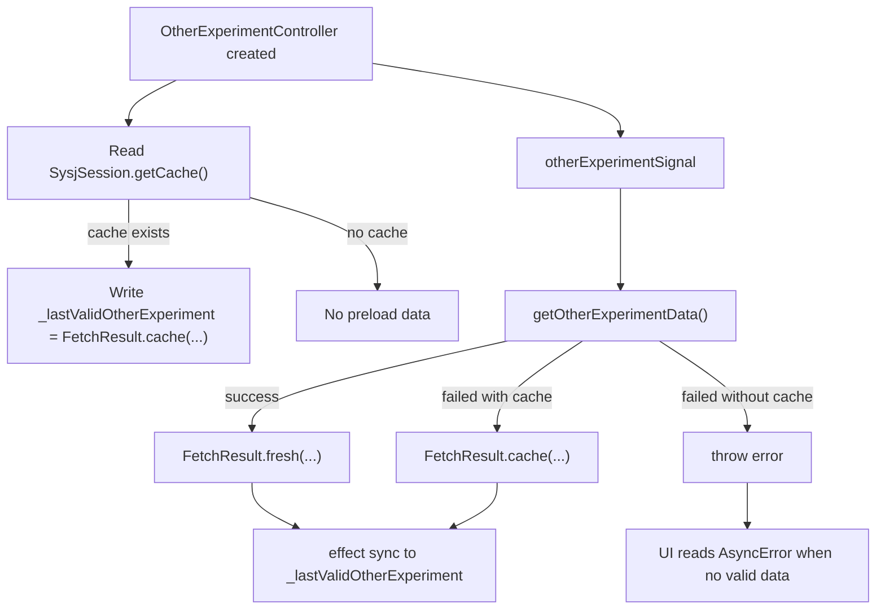

# Other Experiment Management

相关代码：

- `lib/repository/xidian_ids/sysj_session.dart`
- `lib/controller/other_experiment_controller.dart`
- `lib/model/fetch_result.dart`
- `lib/model/xidian_ids/experiment.dart`

## 总览

其他实验模块与物理实验模块采用同一套设计：

1. 仓库层返回 `FetchResult<List<ExperimentData>>`
2. 控制器层保存“最后有效结果”
3. 页面层同时消费：
   - 异步请求状态
   - 最后有效展示结果

不同点主要在于数据来源：

- 物理实验来自 `wlsy.xidian.edu.cn`
- 其他实验来自 `sysj.xidian.edu.cn`

## 仓库层

入口函数：

- `getOtherExperimentData()`

统一返回：

- `FetchResult<List<ExperimentData>>`

返回规则：

- 抓取成功
  - `FetchResult.fresh(fetchTime: DateTime.now(), data: data)`
- 抓取失败但本地缓存可用
  - `FetchResult.cache(fetchTime: cacheTime, data: cacheData, hintKey: "local_cache_hint")`
- 抓取失败且缓存不可用
  - 继续抛错

## 数据来源与聚合

`SysjSession.getDataFromSysj()` 会：

- 走 IDS / sysj 登录流程
- 遍历周次课表
- 解析实验名称、实验室、教师、日期和节次
- 按 `name + classroom + teacher` 聚合同一实验
- 将多个时段合并到同一个 `ExperimentData.timeRanges`

因此：

- 物理实验通常是一条记录对应一个 `timeRange`
- 其他实验更常见的是一条记录拥有多个 `timeRanges`

## 缓存状态

缓存文件：

- `OtherExperiment.json`

缓存读取入口：

- `SysjSession.getCache()`

缓存时间：

- 取自缓存文件的最后修改时间

缓存兼容：

- 同样会检查 `score` 的旧格式缓存
- 检测到旧格式时删除缓存并返回 `null`

## 控制器层

核心字段：

- `otherExperimentSignal`
- `_lastValidOtherExperiment`

派生字段：

- `otherExperiments`
- `hasValidOtherExperiment`
- `isOtherExperimentFromCache`
- `otherExperimentFetchTime`
- `otherExperimentCacheHintKey`

控制器职责：

- 维护当前是否有可展示数据
- 将结果按首页和实验页所需形式继续派生

## 构造期缓存预热

控制器构造时：

- 先读取 `SysjSession.getCache()`
- 若存在缓存，则立即写入 `_lastValidOtherExperiment`

写入结果：

- `FetchResult.cache(...)`
- 当前 `hintKey` 写为 `local_cache_hint`

这样即使网络未完成，页面也可以先显示旧数据。

## 时间派生状态

控制器提供：

- `otherExperimentOfTodayComputedSignal`
- `otherExperimentOfTomorrowComputedSignal`
- `isFinishedOtherExperimentComputedSignal`
- `isNotStartedOtherExperimentComputedSignal`
- `isDoingOtherExperimentComputedSignal`

这些状态的计算方式和物理实验一致：

- 今日 / 明日 -> `HomeArrangement`
- 已结束 / 未开始 / 进行中 -> 复制 `ExperimentData` 并裁剪 `timeRanges`

## 数据流

