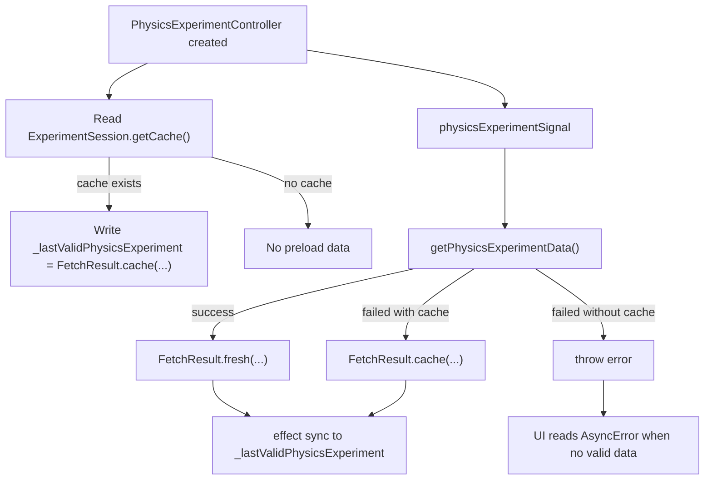

# Physics Experiment Management

相关代码：

- `lib/repository/physics_experiment_session.dart`
- `lib/controller/physics_experiment_controller.dart`
- `lib/model/fetch_result.dart`
- `lib/model/xidian_ids/experiment.dart`

## 总览

物理实验模块当前由两层状态共同决定：

1. 仓库层结果状态
   - `FetchResult<List<ExperimentData>>`
2. 控制器展示状态
   - `futureSignal`
   - `_lastValidPhysicsExperiment`
   - 一组 `computed`

因此，“物理实验当前状态”不是单一字段，而是：

- 请求是否仍在进行
- 当前是否已有可展示数据
- 当前展示的是 fresh 还是 cache
- 当前缓存提示应该怎么写
- 当前数据在时间维度上属于今日 / 明日 / 已结束 / 未开始 / 进行中

## 仓库层

入口函数：

- `getPhysicsExperimentData()`

统一返回：

- `FetchResult<List<ExperimentData>>`

返回规则：

- 抓取成功
  - `FetchResult.fresh(fetchTime: DateTime.now(), data: data)`
- 抓取失败但本地缓存可用
  - `FetchResult.cache(fetchTime: cacheTime, data: cacheData, hintKey: "local_cache_hint")`
- 抓取失败且缓存不可用
  - 继续抛错

特殊规则：

- `PasswordWrongException`
  - 删除缓存后继续抛错
- `NoPasswordException(type: PasswordType.physicsExperiment)`
  - 不会被仓库层特殊吞掉
  - 若本地缓存存在，则最终仍可能返回 `FetchResult.cache(...)`
  - 若缓存不存在，则继续抛错给上层

## 缓存状态

缓存文件：

- `PhysicsExperiment.json`

缓存读取入口：

- `ExperimentSession.getCache()`

缓存时间：

- 取自缓存文件的 `lastModifiedSync()`
- 不是当前时间

缓存兼容：

- `score` 字段从旧 `String` 迁移到新 `RecognitionResult`
- 如果检测到旧缓存格式，会删除旧缓存并返回 `null`

## 控制器层

核心字段：

- `physicsExperimentSignal`
- `_lastValidPhysicsExperiment`

语义：

- `physicsExperimentSignal`
  - 表示当前异步请求态
  - 可处于 loading / data / error
- `_lastValidPhysicsExperiment`
  - 表示当前页面可展示的最后一份有效结果
  - 类型为 `FetchResult<List<ExperimentData>>?`

派生字段：

- `physicsExperiments`
- `hasValidPhysicsExperiment`
- `isPhysicsExperimentFromCache`
- `physicsExperimentFetchTime`
- `physicsExperimentCacheHintKey`

## 构造期缓存预热

控制器构造时会先读取本地缓存：

- `ExperimentSession.getCache()`

若缓存存在：

- 立即写入 `_lastValidPhysicsExperiment`
- 使用 `FetchResult.cache(...)`
- 当前 `hintKey` 写为 `local_cache_hint`

目的：

- 进入首页后，页面可以先显示已有缓存

## 时间派生状态

控制器继续把实验数据派生为：

- `physicsExperimentOfTodayComputedSignal`
- `physicsExperimentOfTomorrowComputedSignal`
- `isFinishedPhysicsExperimentComputedSignal`
- `isNotStartedPhysicsExperimentComputedSignal`
- `isDoingPhysicsExperimentComputedSignal`

处理方式：

- 今日 / 明日
  - 转成 `HomeArrangement`
- 已结束 / 未开始 / 进行中
  - 复制 `ExperimentData`
  - 仅保留符合条件的 `timeRanges`

## 数据流

