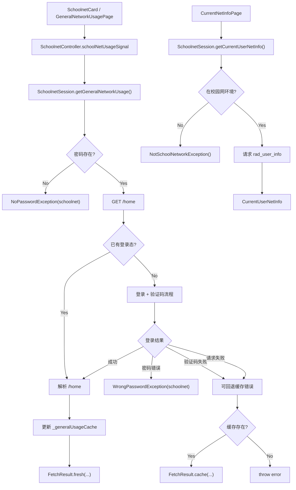
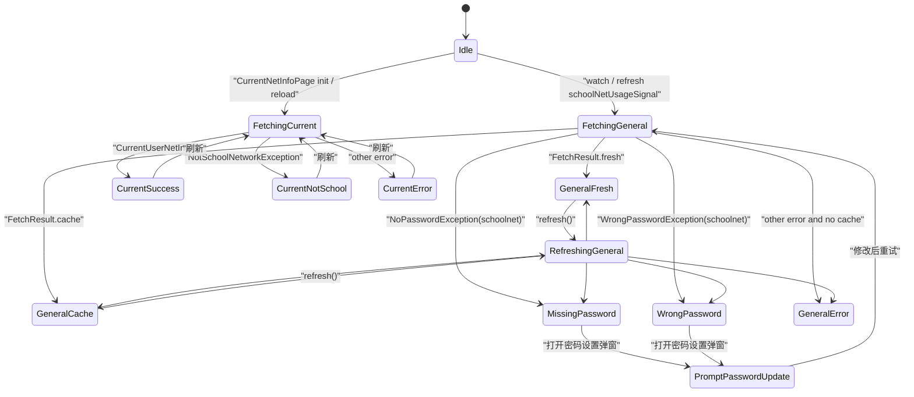

# 校园网状态管理

本文档说明校园网模块当前的状态管理设计。对应代码主要位于：

- `lib/repository/schoolnet_session.dart`
- `lib/controller/schoolnet_controller.dart`
- `lib/model/fetch_result.dart`
- `lib/model/network_usage.dart`
- `lib/model/password_exceptions.dart`
- `lib/model/not_school_network_exception.dart`
- `lib/page/homepage/info_widget/schoolnet_card.dart`
- `lib/page/schoolnet/general_network_usage_page.dart`
- `lib/page/schoolnet/current_net_info_page.dart`
- `lib/page/setting/dialogs/schoolnet_password_dialog.dart`

## 总览

校园网模块目前不是单一状态字段驱动，而是由两条相互独立的数据链路组成：

1. 总览流量链路
   - `SchoolnetController + futureSignal<FetchResult<GeneralNetworkUsage>>`
   - 服务于首页卡片和“当前用户”页
2. 当前在线信息链路
   - `CurrentNetInfoPage + FutureBuilder<CurrentUserNetInfo>`
   - 不走 controller，不做缓存，只做实时查询

## 总览流量链路

### 状态入口

总览流量的统一入口在 `SchoolnetController`：

- `schoolNetUsageSignal`
- `reloadSchoolnetInfo(...)`

`schoolNetUsageSignal` 的类型是：

- `futureSignal<FetchResult<GeneralNetworkUsage>>`

它的仓库层输出来自：

- `SchoolnetSession.getGeneralNetworkUsage(...)`

### 仓库层结果和缓存判断

总览流量查询统一使用 `FetchResult<GeneralNetworkUsage>`：

当前缓存策略是“受限缓存回退”：

- 会走缓存：
  - 验证码失败
  - 网络请求失败 / 查询失败
- 不会走缓存：
  - 缺少校园网密码
  - 校园网密码错误

也就是说，密码类问题会直接暴露给 UI，要求用户修正，而不是继续展示旧数据。

### 程序内缓存状态

缓存定义在 `SchoolnetSession`：

- `_generalUsageCache`
- `_generalUsageCacheFetchTime`

规则：

- 查询成功后更新缓存
- 查询失败时，如果错误属于“可缓存回退错误”且缓存存在，则返回 `FetchResult.cache(...)`
- 查询失败时，如果错误属于密码类问题，则直接抛异常

### 刷新状态

`SchoolnetController.reloadSchoolnetInfo()` 当前使用：

- `schoolNetUsageSignal.refresh()`

而不是 `reload()`。

这样做的效果是：

- 刷新时保留当前 `data`
- 同时把 signal 置为 loading 中
- `GeneralNetworkUsagePage` 可以继续显示旧数据，并在顶部显示 `LoadingAlerter`

因此，总览页的刷新体验是“保留原始数据刷新”，不是“整页清空后重载”。

### 密码错误状态

查阅 `password_exceptions.md`。

### 页面渲染状态

`GeneralNetworkUsagePage` 的渲染规则可以概括为：

1. `data`
   - 渲染 `FetchResult.data`
   - 如果 `isCache == true`，显示 `CacheAlerter`
2. `data + isLoading`
   - 保留当前数据
   - 顶部叠加 `LoadingAlerter`
3. `loading` 且没有现有数据
   - 显示全屏 `CircularProgressIndicator`
4. `error`
   - 缺密码 / 密码错误：显示修改密码入口
   - 其他错误：显示 `ReloadWidget`

### 首页状态接入

首页不单独管理校园网状态，只做状态接入：

- `SchoolnetCard` 通过 `schoolNetUsageSignal.watch(context)` 读取 controller 状态
- 首页下拉刷新通过 `refresh.dart -> reloadSchoolnetInfo()` 触发刷新

因此，首页只是校园网总览状态的消费者，不是状态源。

## 当前在线信息链路

### 状态入口

当前在线信息不进入 `SchoolnetController`，而是在 `CurrentNetInfoPage` 中单独管理：

- `late Future<CurrentUserNetInfo> _currentUserNetInfoFuture`
- `FutureBuilder<CurrentUserNetInfo>`

### 实时查询状态

`SchoolnetSession.getCurrentUserNetInfo()` 的语义是“当前环境下的实时查询”，不是“可缓存业务数据”。

因此它当前不做：

- `FetchResult`
- 程序内缓存
- controller 托管

### 校园网环境判断

如果当前不在校园网环境，仓库层会抛：

- `NotSchoolNetworkException()`

页面据此显示：

- `school_net.current_login_net.non_schoolnet`

这部分原先曾借助 `CurrentUserNetInfoState.notSchool`，现在已经迁移为统一异常模型。

## 数据流图

## 状态图

## 当前设计特点

当前校园网模块的状态管理有这些特点：

- 总览流量是 controller 驱动、支持受限 in-app cache 的共享状态
- 当前在线信息是页面内 `FutureBuilder` 驱动的即时状态
- 密码类问题已从字符串判断迁移到异常类型
- “不在校园网环境” 已从业务状态枚举迁移到统一异常
- 首页只消费校园网状态，不单独保存校园网状态

## AI 认为后续可继续统一的点

如果后续继续整理，优先级最高的两个方向是：

1. 给 schoolnet 定义更明确的业务异常层次
   - 例如验证码错误、初始化失败、解析失败，减少字符串错误 key 直接上浮
2. 把当前在线信息链路是否需要引入统一结果壳单独评估
   - 目前它强调“实时性”，因此不建议直接套用总览流量的缓存模型
