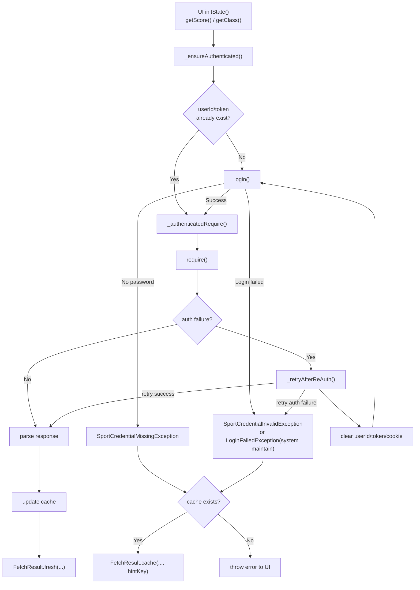
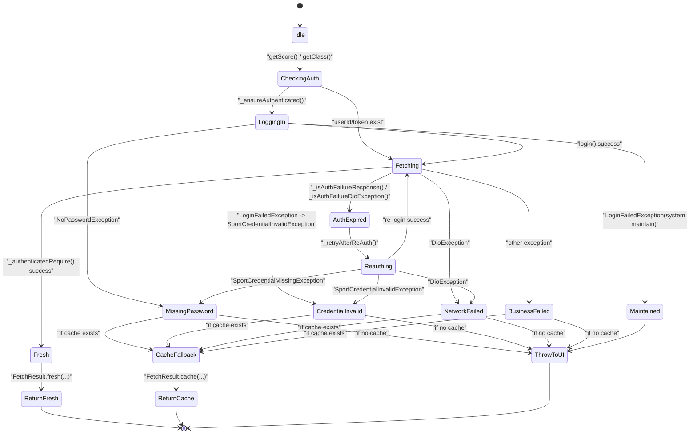
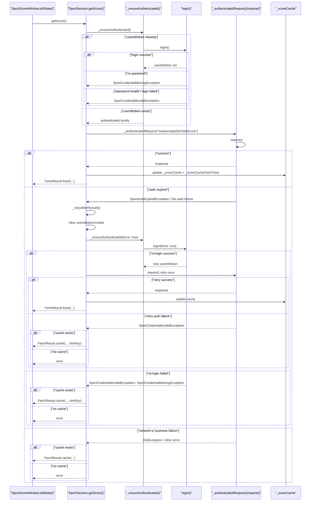

# 体育状况管理

本文档说明体育模块当前的状态管理设计。对应代码主要位于：

- `lib/repository/xidian_sport_session.dart`
- `lib/model/fetch_result.dart`
- `lib/page/sport/sport_score_window.dart`
- `lib/page/sport/sport_class_window.dart`
- `lib/page/homepage/toolbox/sport_card.dart`
- `lib/page/setting/dialogs/sport_password_dialog.dart`

## 总览

体育模块不是用单一 `enum` 管理状态，而是由 4 层状态叠加得到最终行为：

1. 认证状态
   - 由 `SportSession.userId`、`SportSession.token`、`sportCookieJar` 共同表示
2. 缓存状态
   - 由 `_scoreCache`、`_classCache` 及对应 `fetchTime` 表示
3. 数据获取结果状态
   - 由 `FetchResult<T>` 表示是 fresh 还是 cache，以及是否有 `hintKey`
4. UI 渲染状态
   - 由 `FutureBuilder` 的 `connectionState / hasData / hasError` 表示

因此，“体育页面当前是什么状态”实际上是组合状态，而不是单一字段。

## 数据管理

### 认证状态

认证状态的核心数据定义在 `SportSession`：

- `static var userId = ''`
- `static var token = ''`
- `final PersistCookieJar sportCookieJar`

判定规则：

- `userId` 和 `token` 都非空：认为本地当前有登录态
- 任一为空：认为需要重新登录
- 即使都非空，也不代表一定有效；服务端仍可能返回 `401/402/未登录类响应`

### 缓存状态

缓存状态同样定义在 `SportSession`：

- `_scoreCache` / `_scoreCacheFetchTime`
- `_classCache` / `_classCacheFetchTime`

规则：

- 查询成功后更新缓存
- 查询失败时，如果缓存存在，则返回缓存
- 认证失效或密码失效时，不清业务缓存，只清登录态

### 结果状态

仓库层对 UI 的统一输出是 `FetchResult<T>`，详情看 `models/fetch_result.md`。

### 用户界面状态

体育成绩页和体育课程页都使用 `FutureBuilder<FetchResult<T>>`：

- `initState()`
  - 调用 `SportSession().getScore()` 或 `SportSession().getClass()`
- `hasData`
  - 直接渲染 `FetchResult.data`
  - 若 `isCache == true`，显示 `CacheAlerter`
- `hasError`
  - 使用 `ReloadWidget`
  - 对体育异常做 i18n 翻译后展示

## 页面交互逻辑入口

体育模块有两层入口控制：

### 首页体育卡片的入口

首页体育卡片的入口位于 `SportCard.onPressed()`：

- 如果本地 `sportPassword` 为空，先弹 `SportPasswordDialog`
- 用户填写后，才进入 `SportWindow`

这一步只保证“本地存储里有体育密码”，不保证：

- 当前 token 有效
- 新填写的密码一定正确

### 数据获取入口

真正的数据获取入口位于：

- `SportSession.getScore()`
- `SportSession.getClass()`

这两者共享一套认证恢复逻辑：

- `_ensureAuthenticated()`
- `_authenticatedRequire()`
- `_retryAfterReAuth()`

## 数据流图

## 状态图

下面的状态图描述的是“体育查询流程状态”，不是代码里的单一字段。

## 时序

以下以 `SportScoreWindow -> SportSession.getScore()` 为例，`getClass()` 的流程基本一致。

## 认证失败状况

认证失败识别分两层：

### 服务器回复层

函数：`_isAuthFailureResponse(Map<String, dynamic> response)`

识别条件：

- `returnCode == "401"`
- `returnCode == "402"`
- `returnMsg` 或 `msg` 中包含下列关键词之一：
  - `未登录`
  - `登录失效`
  - `自动登录失效`
  - `token失效`
  - `重新登录`

用途：

- 兼容后端不规范返回
- 即使 HTTP 层不是 `401/402`，只要业务消息语义上是“未登录”，也能触发重认证

### Dio 网络客户端库层

函数：`_isAuthFailureDioException(DioException e)`

识别顺序：

1. HTTP `statusCode` 是否为 `401/402`
2. `response.data` 若是 JSON，是否满足 `_isAuthFailureResponse(...)`
3. `e.message / statusMessage / responseData.toString()` 中是否包含鉴权失败关键词

用途：

- 某些请求在 Dio 层直接抛异常，而不是给正常 JSON 响应
- 该函数负责把这类异常重新分类为“认证失败”，从而进入 `_retryAfterReAuth()`

## 缓存策略

缓存策略如下：

- 查询成功
  - 更新业务缓存
  - 返回 `FetchResult.fresh(...)`
- 查询失败且缓存存在
  - 返回 `FetchResult.cache(...)`
- 查询失败且缓存不存在
  - 把异常抛给 UI

特别说明：

- 认证失效时会清 `userId/token/cookie`
- 认证失效时不会清 `_scoreCache/_classCache`
- 因此“旧缓存还能看，但当前登录态已坏”是允许存在的

## 缓存提示和错误提示

仓库层不会直接返回中文提示，而是返回 i18n key。

### 缓存提示

`_cacheHintFromError(...)` 负责把错误转换成缓存提示：

- `SportCredentialMissingException`
  - `sport.cache_hint_missing_password`
- `SportCredentialInvalidException`
  - `sport.cache_hint_credential_invalid`
- 其他错误
  - `null`
  - UI 会退回默认 `inapp_cache_hint`

### 用户界面错误提示

体育页中的 `_translateError(...)` 负责翻译：

- `SportCredentialMissingException`
- `SportCredentialInvalidException`
- `String` 类型的 i18n key

因此：

- 仓库层负责提供结构化错误和 key
- UI 负责根据当前语言翻译并渲染

## 修改密码策略

当前实现对“密码修改”采用延迟生效策略。

### APP 内对体育服务密码的修改

`SportPasswordDialog` 只会更新：

- `Preference.sportPassword`

不会主动清除：

- `SportSession.userId`
- `SportSession.token`
- `sportCookieJar`

结果：

- 如果旧 token 仍有效，用户仍可能继续查询成功
- 只有在旧 token 失效、必须重新登录时，新的本地密码才会真正参与登录

### 体育服务服务器端密码的修改

如果用户在外部把体育系统密码改掉，而 App 中仍保存旧密码：

- 旧 token 有效时
  - 查询可能继续成功
- 旧 token 失效后
  - `_retryAfterReAuth()` 会尝试用本地旧密码重登
  - 重登失败后进入 `SportCredentialInvalidException`
  - 有缓存则显示缓存并提示更新密码
  - 无缓存则直接报错

这也是当前设计有意保留的行为。

## 用户界面渲染说明表格

| 仓库结果 | 用户界面行为 | 主要部件 |
| --- | --- | --- |
| `FetchResult.fresh(...)` | 显示新数据 | `FutureBuilder` + page content |
| `FetchResult.cache(..., hintKey != null)` | 显示缓存，并显示定制缓存提示 | `CacheAlerter` |
| `FetchResult.cache(..., hintKey == null)` | 显示缓存，并显示默认缓存提示 | `CacheAlerter` |
| throw exception | 显示错误页，可手动刷新 | `ReloadWidget` |

## 当前设计策略和可提升点

当前体育状态管理的核心特点是：

- 不是单一状态机字段，而是组合状态
- 认证失败优先尝试自愈
- 自愈失败后优先保留业务缓存
- 只有真正需要时，才把“本地密码不可用”暴露给用户
- 修改本地体育密码不会立即踢掉现有登录态

如果后续需要重构为显式状态机，比较自然的抽象会是：

- `Idle`
- `Authenticating`
- `Authenticated`
- `Fetching`
- `CacheFallback`
- `CredentialMissing`
- `CredentialInvalid`
- `Error`

但当前代码尚未把这些状态显式建模为一个统一 `enum` 或 `sealed class`。
