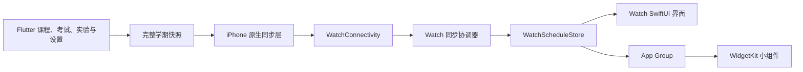
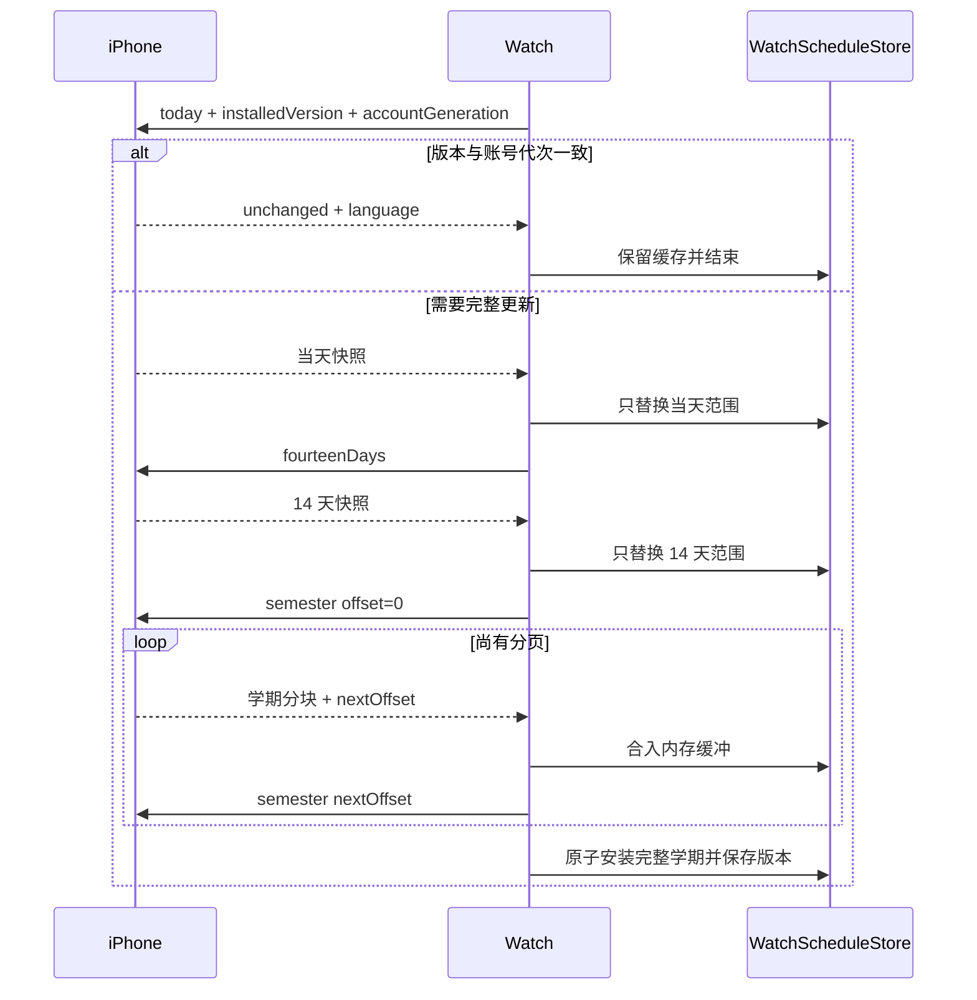

# XDYou Apple Watch 技术说明

本文面向维护者，说明手机与手表的数据边界、同步协议、缓存、界面交互和验证
入口。功能概览与使用方式见 [Apple Watch README](README.md)。

## 总体架构

Apple Watch 功能采用 **iPhone 主数据源 + 原生 watchOS Companion App**
架构。手机负责登录、访问校园系统、合并业务数据和生成课表；手表不保存账号
凭据，也不直接访问学校接口，只展示手机已经展开到具体日期和时间的日程。



系统分为五层：

1. **Flutter 业务层**：课程、自定义课程、考试、实验、学期、周次、提醒和
   App 语言的唯一事实来源；
2. **快照层**：把重复课表展开成带绝对起止时间、节次、颜色和类型的完整
   学期 JSON；
3. **iPhone 通信层**：保存最新完整快照、计算语义版本，并按手表请求裁剪
   当天、近 14 天或学期分页；
4. **Watch 状态层**：负责三阶段同步、校验、范围合并、持久化和派生索引；
5. **展示层**：Watch App 与 Widget 只读取已经校验并安装的数据。

课表数据单向流动。手表发往手机的是同步请求、范围、分页偏移、刷新/请求标识、
账号代次和已完整安装的版本号，不会回传本地完整课表。

## 数据归属与模块边界

| 数据或状态 | 写入方 | 读取方 |
| --- | --- | --- |
| 原始课程、考试、实验与设置 | Flutter | 快照构建层 |
| 完整学期快照与语义版本 | iPhone 原生层 | Watch 通信层 |
| 当前可见课表与三级缓存 | `WatchScheduleStore` | Watch 各视图 |
| 排序、按日分组和五段课程 ID 索引 | `WatchScheduleStore` | 列表、日、周、月视图 |
| 月份网格和三页预热窗口 | `MonthCalendarCache` | 月视图 |
| 日视图卡片高度 | `DayCourseLayoutTracker` | 日视图纵向导航 |
| 页面位移、表冠会话和吸附状态 | 对应 SwiftUI View | 仅对应页面 |
| Widget 课表、语言与交互状态 | App Group | Widget Extension |

主要目录：

| 路径 | 职责 |
| --- | --- |
| `lib/repository/watch/` | 构建完整学期快照并监听手机数据变化 |
| `ios/Runner/WatchConnectivityManager.swift` | iPhone 快照、版本、范围裁剪、回复和 `WatchSyncApiImplementation` 桥接实现 |
| `ios/Runner/PhoneWatchQueuedScheduleTransport.swift` | 后台队列请求转发与关联 |
| `watchOS/Connectivity/WatchConnectivityManager.swift` | Watch 三阶段同步状态机 |
| `watchOS/Storage/WatchScheduleStore.swift` | 快照安装、缓存、索引和公开状态 |
| `watchOS/Storage/DayCourseLayoutCache.swift` | 卡片高度采样、双向位移换算和可暂停持久化 |
| `watchOS/Shared/WatchSyncSupport.swift` | 协议键、同步范围、schema、语言映射、日期和文本纯函数 |
| `watchOS/Shared/WatchWidgetShared.swift` | App Group、缓存编码、语言读取与 Widget 交互状态 |
| `watchOS/Shared/WatchSchedulePresentation.swift` | 范围合并、课程焦点、概览和时间线状态 |
| `watchOS/Shared/WatchWidgetDesignTokens.swift` | 小组件主要文字层级 |
| `watchOS/Views/RootScheduleView.swift` | 顶层路由、提示、悬浮控件和详情层 |
| `watchOS/Views/OverviewScheduleView.swift` | 今日摘要、当前与下一项、本周待办统计 |
| `watchOS/Views/CourseListView.swift` | 整学期自然日分组列表 |
| `watchOS/Views/DayScheduleView.swift` | 单日课程、纵向浏览与横向翻日 |
| `watchOS/Views/WeekScheduleView.swift` | 周次边界、七日网格与色块命中 |
| `watchOS/Views/MonthScheduleView.swift` | 月份网格、日程标记与日期提交 |
| `watchOS/Views/MonthCalendarData.swift` | 月份轻量模型、标记组装和三页内存缓存 |
| `watchOS/Views/CourseViews.swift` | 共用课程卡片和顶层详情页 |
| `watchOS/Views/CalendarPagingSupport.swift` | 日/周/月共用分页、吸附和表冠桥接 |
| `watchOS/Views/InteractionAwareScrollView.swift` | 列表滚动观察和顶部保护 |
| `watchOS/Views/WatchInteractionSupport.swift` | 可取消任务、按压状态、完成去重、触觉和表冠连续会话 |
| `watchOS/Views/WatchOnboardingView.swift` | 实操引导步骤、输入桥、顶层遮罩、欢迎页和动作动画 |
| `watchOS/Views/Onboarding/WidgetOnboardingView.swift` | 五页组件指南、分页、自动播放和完成生命周期 |
| `watchOS/Views/Onboarding/WidgetIntroPage.swift` | 内容页容器、黑色过渡页、课程和形态介绍 |
| `watchOS/Views/Onboarding/WidgetInstallGuideView.swift` | 系统添加小组件的三步示意 |
| `watchOS/Views/Onboarding/WidgetPreviewView.swift` | 截图资源映射、原比例展示和辅助功能说明 |
| `watchOS/Assets.xcassets/WidgetGuide/` | 组件指南使用的 18 张固定截图裁切素材 |
| `watchOS/Widget/` | 表盘 Complication、Smart Stack 与时间线 |

通信层不保存 SwiftUI 页面状态，View 不直接解析 WatchConnectivity 字典；
Store 不持有页面手势和动画状态。

## 状态与任务生命周期

`RootScheduleView` 只持有跨页面路由和短生命周期 UI 状态。异步任务按职责分组：

- 悬浮控件组：按钮自动隐藏、缓存提示和引导完成提示；
- 引导组：章节过渡、首轮渲染准备和表冠停止判定；
- 月视图预热组：不可交互月视图的短时挂载。

根页面消失、引导重新开始或引导完成时，通过统一取消入口结束对应 Task 并清空
引用。引导正常推进和错误恢复共用同一个路由安装函数，模式、教学日期、日期
选择器、详情课程和悬浮控件状态会作为一组提交，避免两条路径形成不同状态。

`WatchScheduleStore` 是可见课表和派生索引的唯一写入者。快照安装、索引恢复、
课程列表入口和月份预热都由 Store 的明确入口完成；视图只调用查询方法。可恢复
错误统一带阶段标签写入系统日志，用户提示与缓存回退仍由发生错误的业务入口
决定。

## 手机端课表生产

### iPhone 接入与文件职责

手机提供日程生产和传输入口，手表按需取得当天、近 14 天及完整学期。课表变化
经 400 毫秒防抖后同步，语言使用独立监听；清缓存、退出和重新登录通过账号
代次及串行写入联动，防止旧刷新恢复已清空的数据。

| 文件 | 职责 |
| --- | --- |
| `lib/repository/watch/watch_schedule_snapshot.dart` | 将学校课表、自定义课程、考试与实验展开成完整学期，携带教师、地点、节次、颜色、座位、时区和提醒参数 |
| `lib/repository/watch/watch_schedule_sync_service.dart` | 监听数据与语言，管理防抖、任务代次、串行发送及清空/恢复同步；仅在 iOS 启动 |
| `lib/main.dart` | 启动 `WatchScheduleSyncService` |
| `lib/controller/theme_controller.dart` | 提供实际生效的语言标识，将“跟随系统”解析为明确语言 |
| `lib/controller/homepage_controller.dart`、`lib/repository/widget_state_sync.dart`、`lib/page/setting/groups/core_section.dart` | 在刷新、登录状态和清缓存流程中调用同步服务；用会话修订阻止迟到刷新恢复旧账号数据；清理包括 `CustomClassesV2.json` 在内的共享文件 |
| `pigeon_bridge/save_to_groupid.dart` | 定义 `WatchSyncSwiftApi` 的课表同步、语言同步和清空接口 |
| `lib/bridge/save_to_groupid.g.dart`、`ios/Runner/SaveToGroupID.g.swift` | 由同一 Pigeon 定义生成 Dart/Swift 通道；接口变化时同步生成 |
| `ios/Runner/WatchConnectivityManager.swift` | `PhoneWatchConnectivityManager` 持久化完整快照、计算语义版本、裁剪范围与分页并发布状态；同文件的 `WatchSyncApiImplementation` 将 Pigeon 调用转发给管理器 |
| `ios/Runner/PhoneWatchQueuedScheduleTransport.swift` | 验证后台请求并在回复中附带刷新/请求标识，复用即时通道的回复生成逻辑 |
| `ios/Runner/AppDelegate.swift` | 激活 WCSession、注册文件共享与 Watch 同步两套 Host API，并配置前台通知显示 |
| `ios/Runner/ApiImplementation.swift` | 实现原有 `SaveToGroupIdSwiftApi`，负责共享文件写入与删除；Watch 同步使用独立的 `WatchSyncApiImplementation` |
| `ios/ClasstableWidget/ClasstableWidget.swift`、`ios/ClasstableWidget/EventItem.swift` | iPhone 小组件的数据读取、时间线和课程行展示；时间线包含当前节点及当天未来课程边界，午夜重新请求，日期取自时间线节点 |
| `ios/Runner.xcodeproj/project.pbxproj` 与 `ios/Runner.xcodeproj/xcshareddata/xcschemes/` | 声明 Watch App/Widget target、依赖、嵌入关系及 Runner、TraintimeWatch 构建入口 |
| `lib/repository/preference.dart`、iOS/Watch entitlements、`ios/Runner/Info.plist` | 配置共享容器与应用关联；App Group、Bundle ID 和 Companion 标识需与工程配置一致 |

手机使用既有页面和数据源，设置入口调用同步服务处理状态，不传递校园登录
凭据。课程提醒由手机已有通知系统调度。iPhone 小组件仍读取其共享文件，Watch
App 与 Watch Widget 使用独立的快照缓存；两种数据格式不能互相替代。

### 完整快照

Flutter 将以下内容转换为统一的 `WatchCourseOccurrence`：

- 学校课程；
- 自定义课程；
- 考试及座位号；
- 物理实验和其他实验；
- 学期起点、当前周次和数据覆盖范围；
- 时区、提醒提前时间和与手机端一致的课程颜色。

日程类型包括 `course`、`exam`、`physicsExperiment` 和
`otherExperiment`。当前快照 schema 为 4，Watch App 与 Widget 共同使用
`WatchWidgetShared.supportedScheduleSchemaVersions` 校验支持范围。

### 语义版本

iPhone 对完整学期 JSON 按键排序后计算 SHA-256，仅移除
`generatedAtEpochMs`。课程、日期、节次、颜色、周次、提醒、地点、教师、座位
或其他保留字段变化时都会产生新版本。语言通过独立消息同步，不属于快照哈希。

手表请求携带已完整安装的版本号和账号代次：

- 版本与账号代次都一致：手机返回 `scheduleUnchanged` 和轻量设置，不发送课表正文；
- 版本、账号代次不匹配或手表没有完整版本：执行当天、14 天、学期三阶段同步。

只有完整学期所有分页安装成功后，手表才持久化新版本。局部缓存不能代表完整
课表，因而当天或 14 天阶段不会提前更新版本号。

## 渐进同步

### 阶段顺序



同一轮三个阶段必须属于同一版本和账号代次。中途版本变化时，Watch 丢弃
学期缓冲并从当天重新开始，避免把两份课表拼接在一起。

### 通信通道

| 通道 | 用途 |
| --- | --- |
| `sendMessage` | 前台可达时的低延迟请求与回复 |
| `transferUserInfo` | 实体表即时失败后的后台队列 |
| `updateApplicationContext` | 最新 14 天快照、版本和语言的启动兜底 |

即时和后台通道共用 iPhone 的回复生成函数，范围过滤、版本判断和分页语义保持
一致。Watch 只保留一个 `PendingScheduleRequest`，绑定请求 ID、范围和偏移；
收到回复时先核对刷新/请求 ID，再认领并清除该请求，两通道只消费一次。回复
范围必须匹配当前请求，有后续页时偏移必须向前推进；末页不能回退，但允许
偏移不变的空末页。当天和 14 天不能分块。

单轮渐进同步最长等待 12 秒，与启动等待新回复的 3 秒窗口独立管理。12 秒
超时且无法恢复 Application Context 时，失败处理清空学期缓冲；若此时等待
后续学期分页（`offset > 0`），该请求的迟到回复只能触发从当天重新同步，
不能把后半段课程安装为完整学期。首个学期页及当天、14 天阶段的迟到回复仍可
继续处理；旧刷新和已消费请求的回复直接忽略。Context 恢复成功时保留继续
接收本轮回复的路径。模拟器不建立 `transferUserInfo` 队列，即时发送失败时
使用 Application Context 兜底。

### 启动与离线

Watch App 每次打开或回到前台都会请求同步：

- 3 秒内没有手机回复且存在有效学期缓存：继续展示缓存，并显示可轻点关闭、
  15 秒自动消失的紧凑提示；
- 没有任何可展示学期日程：显示“请打开手机 XDYou”页面；
- 同步阶段失败或超时：保留原页面和原缓存；
- 每个阶段成功后立即替换该阶段覆盖范围，不清除范围外日期。

## 启动准备与交互性能

启动工作按“数据依赖是否已经具备”分成三层，避免把可以提前完成的计算推迟到
用户第一次进入页面时：

| 时机 | 完成的工作 | 不在此阶段执行的工作 |
| --- | --- | --- |
| `WatchScheduleStore` 初始化 | 解码三级课表缓存、校验并恢复派生索引、计算列表入口与教学日期、预热当前月份和教学月份的相邻三页 | 网络请求、SwiftUI 页面创建 |
| 根视图首帧之后 | 激活 WatchConnectivity、发送带已安装版本号的同步请求、短暂预挂载不可交互的月视图渲染树 | 整学期排序、JSON 编码 |
| 已知表盘宽度之后 | 校验日卡片布局签名并恢复卡片高度 | 与当前宽度不匹配的布局缓存 |

课表索引安装后，列表、日、周、月和教学入口只读取数组或日期字典，不在手势、
表冠和动画逐帧路径中扫描整学期。教学日期在安装索引时一次算好；月份窗口在
Store 初始化或新课表安装时准备。只有依赖真实 SwiftUI 几何的卡片高度和控件
坐标必须等页面完成布局后采样。

月份缓存除单月日期模型和五段课程标记外，还以中心月为键保存已经组装好的
前、中、后三页原子窗口。根视图首帧完成后会以近乎透明、禁止命中且不申请
表冠焦点的方式短暂挂载一次真实 `MonthScheduleView`，提前建立
`NavigationStack`、分页器、Canvas 和工具栏的首次渲染管线，随后自动移除。
首次打开月视图直接读取已准备的数据窗口和已经建立的渲染管线。

派生索引和卡片高度先立即更新内存，再由可取消的后台任务编码 JSON。连续收到
当天、14 天和学期数据时，仅最新代次允许写入 Defaults；过期任务即使完成也
不会覆盖新索引。阶段数据立即更新内存，JSON 编码移出交互线程；最终 Data 写入
仍由主线程提交。

## 持久化缓存

缓存按数据生命周期拆分，不能简单合成一个大对象。课表正文需要阶段级原子
替换；派生索引可重建；卡片高度还受语言和表盘宽度影响。分层存储能让单项
损坏只触发该层重建。

### 缓存清单

| 缓存 | 存储位置 | 内容 | 失效或重建条件 |
| --- | --- | --- | --- |
| 当天课表 | Standard + App Group | 当天完整快照 | 新当天阶段完成 |
| 近 14 天课表 | Standard + App Group | 14 天完整快照 | 新 14 天阶段完成 |
| 完整学期课表 | Standard + App Group | 权威学期快照 | 学期全部分页完成 |
| 已安装版本 | Standard | iPhone 语义版本 | 完整学期缺失或新学期安装 |
| 展示派生索引 | Standard | 排序 ID、自然日分组、五段标记、列表入口 | 来源快照不匹配或 schema 变化 |
| 日卡片布局 | Standard | 课程 ID 到实测卡片高度 | 当前快照修订、语言、宽度、动态字体或粗体设置变化 |
| 月份预热窗口 | 运行时内存 | 最多八个中心月的三页网格与标记 | 课表、系统日历或时区变化；超限淘汰最近最少访问窗口 |
| Widget 交互状态 | App Group | 综合组件当前课程 ID 与下一节预览截止时间 | 五分钟、当前下课、下一项上课或当前 ID 改变 |

私有缓存键统一定义在 `WatchPersistentCacheKey`；Codable Data 的编码和读取统一
经过 `WatchCacheCoding`。课表正文的三个共享键及其稳定读取顺序由
`WatchWidgetShared` 唯一维护，Store 与 Widget 读取同一组键名和 schema 范围。

### 原始课表恢复

启动时每个范围分别解码 Standard 与 App Group 两份候选，选择修订较新的有效
副本；坏数据只影响自身。`WatchScheduleResolver` 按 `sourceRevision` 排序，旧
协议缺少修订号时才用生成时间。同一修订号中完整学期具有最终权威性。

同学期的新当天或 14 天快照只覆盖自己的明确范围，保留范围之外的课程；范围
内空数组也代表取消全部日程。不同学期不拼接。每段覆盖范围保留自己的有效期，
局部更新不能延长其他日期旧数据的有效期。概览复用索引安装时计算好的合并结果。

清空和退出通过独立协议传递 `scheduleCleared`、`signedOut`、`stateRevision`
和 `accountGeneration`。旧修订或旧账号回复不能恢复已清空课表；本地索引、卡片
高度、Widget 预览和教学目标同时失效。完整学期缺失时会清除孤立版本号，防止
只有版本、没有正文却向手机误报“无需更新”。

### 持久化派生索引

`WatchScheduleStore` 在快照安装时一次生成：

- 稳定排序后的课程数组；
- `Date -> [WatchCourse]` 自然日索引；
- 课程列表分组和首次定位日期；
- `courseID -> WatchCourse` 映射；
- 每日五个两节区间对应的课程 ID。

新建和恢复最终都经过 `installVisibleScheduleIndex`，确保所有派生字段原子安装。
派生索引 schema 为 2，来源身份包含原快照 schema、生成时间、单调修订号、范围、
课程数量、系统日历和时区。全部匹配才复用；不匹配的索引会从原始快照重建。
iPhone 的语义版本是“课表是否变化”的唯一依据，来源身份仅防止本地文件错配。

恢复流程按职责拆分：先校验缓存与原始快照身份，再恢复课程 ID 和自然日索引，
最后恢复课程列表入口。课程顺序、自然日归属和五段节次标记必须与原始课表
一致；重复日期、课程遗漏、错误顺序或不匹配的标记会使恢复失败。跨自然日时
只重算列表入口；任一结构校验失败则整体回退到原始课表重建，不安装部分索引。
排序和校验共用 `WatchScheduleResolver.precedes` / `isSorted`；每日标记的生成
与恢复校验共用 `WatchScheduleStore.makePeriodCourseIDs`，避免两套规则漂移。

课程列表入口、教学示例日期和索引课程数量也在安装入口中一次更新，后续完整性
检查和教学启动均为常量时间。派生缓存 JSON 在后台编码；主线程只负责安装内存
值和提交最终 `Data`。

### 月视图运行时预热

`MonthCalendarCache` 管理两类生命周期不同的数据：

- 日期网格依赖年月、系统日历和时区，可跨课表版本复用；
- 五段标记引用当前课表课程，课表索引变化时单独失效。

Store 恢复派生索引后立即预热当前月及前后两月。日视图选择日期变化时预热该
日期对应的三页窗口；月视图只接收已经成组准备好的日期模型和标记字典。页面
入场、横向拖动和表冠逐帧路径因此只读取内存，不执行整学期扫描、颜色转换或
持久化编码。

缓存保留最近访问的八个中心月。淘汰窗口时，同时释放不再被窗口引用的单月网格
和课程标记，最多保留 24 份单月数据。前台恢复或系统时区通知会校验日历环境，
变化后重建自然日索引和月份窗口，不改动原始课程时间戳。

### 日视图布局缓存

日视图使用课程真实卡片高度把连续课程索引换算成像素位移。高度缓存签名包含：

- 当前可见快照 schema、修订号、生成时间和数量，不能只依赖旧完整学期版本；
- 手机同步的界面语言；
- 当前表盘内容宽度、Dynamic Type 大小和文字粗细；
- 布局缓存 schema。

相邻三页预先测量卡片，测量结果先合并到内存。尚未测量的卡片使用已测高度
平均值估计；`refreshAverageMeasuredHeight` 在采样或恢复时更新，清空时失效，
交互中直接读取。手指或表冠逐帧操作期间暂停新的 JSON 编码，暂停期间新增测量
也不能重新排队写盘；已开始的后台编码允许完成计算，但取消检查会阻止提交。
停止交互后按 1.5 秒
延迟合并写盘。页面离开取消任务，清空代次阻止后台编码结果重新写回。恢复高度
时过滤非法数值。实现独立于 View，可以使用临时 Defaults 直接运行回归测试。

## Watch App 界面

三点按钮提供五种模式：

1. **概览**：今日分类统计，最多显示当前和下一项，再补充本周安排摘要；
2. **课程列表**：按自然日分组浏览整学期日程；
3. **日视图**：浏览单日课程卡片；
4. **月视图**：浏览月份并选择日期；
5. **周视图**：显示第 1–10 节的七日色块网格。

课程、考试和实验使用手机传来的颜色。列表和日视图使用 24 小时制，地点与
教师或考试座位号同行显示，超出宽度时尾部省略。

概览通过 `WatchOverviewSummary` 生成摘要。今日课程、考试、实验按日程条目
计数，正在进行的项目仍属于未结束安排；全部结束后保留当天已完成的分类数量。
已完成项数只在当天仍有剩余安排时补充，避免重复“今日安排已完成”。课程区域
最多展示当前项与下一项，无当前项时仅显示下一项。教师或考试备注与位置同行，同一天的日期也不在每张卡片上重复。

今日最终结束时间只在它没有出现在当前/下一项卡片时补充。本周摘要提供剩余
安排天数及待考、待实验数量，“待考/待做”只计算尚未开始的项目。今日计数要求
当天完整覆盖；本周未来统计仅要求从当前时刻到周末完整覆盖，不因未同步已过去
的日期而隐藏可靠的未来信息，也不把过期或有断档的缓存当作已知安排。

`WatchSchedulePresentation.weekCourses` 与 `weekIsComplete` 在一次查询中只计算
一次周区间。Widget 的普通展示直接复用同一 Presentation，仅临时预览下一节时
另建结果，避免同一个时间线节点重复扫描相同课表。

概览、课程列表和课程详情都使用 `InteractionAwareScrollView` 区分触摸和
表冠输入。概览与详情等普通内容先测量自然高度；课程列表的 `LazyVStack`
保留系统 ScrollView 的原生尺寸提案，以便懒加载内容建立完整滚动范围。
长列表和详情只观察系统 ScrollPhase，不安装额外 DragGesture，保证真实内容
始终跟手；只有不足一屏且系统可能漏报 `.tracking` 的概览教学会启用轻量触摸
兜底。详情覆盖周视图时，焦点直接交给内部原生 ScrollView，关闭后再由周视图
恢复焦点。

### 实操引导与组件指南

两种教程分别管理输入与展示：实操引导观察真实页面操作，小组件指南展示固定
示例并允许分页阅读。`RootScheduleView` 统一管理入口和完成状态。

| 组件 | 职责 |
| --- | --- |
| `WatchOnboardingStep` | 教学顺序、目标页面、文案和期望操作 |
| `WatchOnboardingInputBridge` | 接收实际操作并判定成功、错误或等待 |
| `WatchOnboardingOverlay` | 实操遮罩、进度、动作与结果动画 |
| `WidgetOnboardingView` | 五页阅读流程、轮播、表冠和结束计时 |
| `RootScheduleView` | 教学路由、示例日期、入口来源和完成持久化 |

#### 实操流程

本学期存在教学日程且尚未完成引导时进入欢迎页。教学日期在 Store 安装索引时
选定：优先课程较多的日期，同数量时选离今天较近的一天。没有日程则先显示手机
同步提示，收到可用日程后再进入欢迎页。数据准备与首屏渲染完成后允许轻点开始。

教学顺序为概览、课程列表、日视图、周视图和月视图，覆盖真实点击、手指浏览、
表冠浏览、日期选择和课程详情。最后练习按住右下角三点按钮三秒。每个步骤
对应唯一 `WatchOnboardingOperation`，触摸与表冠不能互相代替。

欢迎页和五个视图分段页使用黑色背景与 `WatchOnboardingSweepingLightText`
扫光。欢迎页不显示章节进度；分段页显示 `1/5` 至 `5/5`，等待轻点继续。实操
提示使用实际页面上的固定标题、蓝色进度和动作说明。开始输入时提示淡出，
抬手或滚动停止后判定；成功显示绿色对号，错误显示白色错号并恢复当前教学路由。
最终长按练习成功后衔接组件指南，实操结束时尚不写入完成标记。

浮动控件的点击目标取实际全局 frame。周视图只接受当前页且至少 80% 面积
位于视口内的课程色块，再冻结目标中心；日、周、月标题箭头共用固定响应中心。
根视图把全局中心转换为教学视口坐标，表冠输入不会被误当成色块点击。
实操说明、动作提示和结果层禁止命中，由底层真实页面执行操作并旁路上报。

| 系统版本 | 原生滚动完成判定 | 教学触摸视觉 |
| --- | --- | --- |
| watchOS 11 及以上 | `ScrollPhase` 区分 tracking/interacting/idle，并保留触摸来源标记 | 概览使用弹性偏移；列表通过 `ScrollPosition` 连续定位 |
| watchOS 10 | 触摸结束兜底；具备来源标记且无程序化视觉代理时，使用真实位移和 0.35 秒静止窗口补报表冠 | 概览使用弹性偏移；列表保留系统滚动 |

指定教学步骤使用触摸视觉代理时，禁用同一方向的原生位移，避免双重推动。
`WatchInputCompletionGate` 使系统 idle 和 0.08 秒触摸兜底仅提交一次完成。
教学上下文变化、页面离开和系统取消均取消旧任务并推进代次。watchOS 10 的
来源判定属于兼容推断，应按系统版本纳入后续回归范围。

`GestureState` 处理没有 `onEnded` 的取消路径。分页取消只回收位移，不提交
教学或额外翻页。表冠使用单调时钟划分会话，有效输入才提交教学，避免系统
校时影响方向判断。

#### 三秒长按与入口

三点按钮和黑色欢迎页复用 `makeWatchHoldFeedbackTask` 与
`WatchHoldFeedbackPulse`。按住 0.3 秒后开始触觉脉冲，在三秒内由轻到重、
强度由 0.25 增至 1，间隔由 0.28 秒缩至 0.12 秒，满三秒立即触发，无需抬手。
这是离散脉冲序列，实际触感由设备与系统控制。

按压超过 36 pt 位移、系统取消、页面离开或进入后台都会停止计时与反馈；同一轮
移回有效范围不会重新计时。正常浏览时三点按钮短按打开视图列表，长按重启完整
引导；实操要求长按时，误点只进入错误反馈，不弹出视图列表。

黑色欢迎页任意位置长按可直接进入组件指南，此入口无需等待教学预热完成。
短于 0.3 秒的有效轻点在准备完成后开始实操；已开始反馈但未满三秒松手则留在
欢迎页。满三秒的任务与抬手兜底共用完成门，避免重复跳转。欢迎页提供相应的
VoiceOver“小组件使用指南”操作，三点按钮也提供重新打开引导的辅助功能操作。

视图列表的“使用指南”分组同时提供“App 操作教程”和“小组件使用指南”。
后者不需要真实课表。入口以 `WidgetOnboardingEntry.fullTutorial` 或 `.guide`
区分：完整教程及欢迎页快捷入口在指南结束后写入
`XDYouWatchCompletedOnboardingV1`；单独阅读指南不修改该标记。

#### 五页组件指南

| 页 | 内容与操作 |
| --- | --- |
| 1 | 黑色扫光“还有一个更快的方法”；轻点后使用 0.38 秒水平过渡滑入第 2 页 |
| 2 | 综合课表圆形、表角和长方形的课中示例，以及圆形和长方形的次日示例 |
| 3 | 选择圆形、表角或长方形，展示所选形态的组件、状态及用途说明 |
| 4 | 循环演示长按表盘、编辑复杂功能和选择 XDYou，并显示对应操作说明 |
| 5 | 黑色“教程结束 / 开始愉快的使用吧”，前台停留两秒后自动返回概览 |

左右滑动、数码表冠、分页点和辅助功能调整操作共用页码选择逻辑。第一页的
轻点过渡临时锁住输入，结束后交还系统分页；减少动态效果开启时直接换页。
第 2–4 页的内容与分页点顺序布局，标题、图片区域、说明各自有有限高度，避免
系统分页安全区使底部内容重叠。正文采用 `WidgetTutorialLayout` 的共享参数，
第 4 页底部说明按 `3/5` 比例缩小并释放展示区空间。

卡片及安装步骤每三秒循环。手动切换重置下一次播放等待，自动切换不会结束
循环；第 3 页圆形有八个示例、长方形七个、表角一个综合课表课中示例。当前页
选中且 App 在前台时才播放；减少动态效果、VoiceOver 或第一页过渡期间暂停。
第五页倒计时依据实际页码和场景状态，不能用相邻预加载页的 `onAppear` 开始；
离开或进入后台取消倒计时，完成门保证只调用一次结束回调。

示例使用 `Assets.xcassets/WidgetGuide/` 中的 18 张原图裁切 PNG，保留截图
文字、图标和颜色。独立组件共用 164×70 的参考画布，按剩余视口等比缩放；
安装示意使用 164×134 参考画布。图片映射、课程示例和辅助功能说明集中在
`WidgetPreviewView.swift`，不读取实时课表、不写缓存、不建立 Widget 时间线。
截图内文字保持原图，周围说明和语音描述使用当前语言。改变真实组件内容时
需同时检查示例图片和语义说明是否仍然合适，不能仅更新代码标签。

教程结束回到概览顶部，显示可轻点关闭、15 秒自动消失的提示。结束指南只记录
教程阅读，不判断用户是否已添加系统小组件。通过实际小组件打开 App 会暂停
本次教程并进入概览，不将尚未完成的教程永久标记为完成。

#### 教学数据与预热

Store 初始化已准备课程列表索引、示例日期和月份窗口；欢迎页确认数据和首屏
材质可用。加载期间在黑色页面后挂载不可交互的材质及动作首帧，不循环运行
不可见动画。同一视图在步骤变化时保持 identity，只更新教学状态。

首次进入课程列表章节且底层数据尚未准备完成时，分段页显示渲染提示，完成后
给出触觉和文字确认。章节页立即插入、淡出移除，底层路由在黑色覆盖提交后
变化。同步删除教学目标、清空示例日期或清空课表时，旧详情和坐标失效，并
重新检查教学是否可用。

### 共用分页基础设施

日、周、月视图复用以下实现：

- `CalendarHorizontalPager`：稳定的前、中、后三页容器和触摸轴锁定；
- `horizontalDragMotion`：按位移、预测位置和末速度决定目标页；
- `calendarCrownPageMotion`：把表冠刻度与速度换算成横向像素；
- `normalizedContinuousPageOffset`：完整跨页后的无动画换底；
- `horizontalPageSnap`：生成目标位置和吸附时间；
- `CalendarPagingCrownInputModifier`：统一表冠范围、步长、灵敏度和系统声音；
- `CalendarCrownIdleCoordinator`：位于 `WatchInteractionSupport.swift`，统一 `onIdle`
  确认与实体表漏回调兜底，可独立运行状态机测试。

页面只保留自己的业务差异：日视图的纵向卡片阶段、周视图的学期边界、月视图
的月份模型和日期提交。共享组件不包含课程数据，也不改变页面布局。

### 日视图

- 前一天、当前日和后一天预渲染，横向触摸与页面位移保持 1:1；
- 同一个触摸层先识别横向或纵向，锁定后保持单一轴向；
- 纵向触摸和表冠共用同一内容偏移与课程索引；
- 多项日程先纵向浏览，达到末项后转入连续横向翻日；
- 零项或一项日程直接横向翻日；
- 触摸松手支持惯性、阻尼、边界回弹和末项安全留白；
- 横向完整跨屏后立即换底，持续旋转表冠可连续翻日；
- 日期标题可打开独立月份页；日视图不打开课程详情。

卡片高度预热和持久化使相邻有课日期进入屏幕前已经具备布局数据；页面偏移
变化不会重新排序课程或查询整学期快照。
惯性帧差使用单调时钟，避免系统校时造成跳变。延迟恢复表冠焦点前核对页面
代次和日期选择层状态，页面退出后旧回调不能重新获取焦点。

### 周视图

- 周标题优先使用手机同步的周次参考；
- 可浏览范围限制在手机完整学期首周与末周；
- 当前日期列使用淡色高亮；
- 手指、标题箭头和表冠共用横向分页；
- 点击色块打开顶层课程详情，点击空白区域恢复悬浮控件；
- 学期边界使用阻尼位移和触觉反馈，不提交无效周次。

### 月视图与日期选择

月视图与日视图日期入口共用 `MonthScheduleView`：

- 页面是根视图中的独立全屏层，从底部进入和退出；
- 星期栏、月份标题和网格属于同一转场；
- 手指、表冠和标题箭头均可翻月；
- 当前月和相邻月份构成轻量三页窗口；
- 单月使用一个异步 Canvas 绘制日期、网格、今天红框和五段标记；
- 点击坐标换算为 7 列日期索引，不创建 35/42 个按钮；
- 普通日期为亮白色，选中日期为蓝色加粗；
- 今天使用透明红色粗框；有日程时红框同时包住日期和五段标记；
- 五段依次代表第 1–2、3–4、5–6、7–8、9–10 节，有课使用课程色，
  空闲段使用暗白色，整天无日程不绘制五段。

### 课程详情与悬浮控件

课程详情位于 `RootScheduleView` 最上层，从底部弹出，不使用系统 Sheet。
内容使用原生 ScrollView，手指和表冠均可滚动；关闭后再把表冠焦点交还周视图。

刷新按钮位于右上方，模式按钮位于右下方。滚动或转动表冠时自动隐藏；等待
手机或正在同步时保持显示。同步完成提示和缓存提示不阻塞页面操作。

## 国际化

Watch App 与 Widget 支持：

- 简体中文 `zh_CN`；
- 繁体中文 `zh_TW`；
- 英语 `en_US`。

手机 App 当前实际生效语言是首选来源。Watch Store 把语言写入 App Group，
App 与 Widget 共用。目录、状态和周次通过 `watchLocalizedString` 读取 String
Catalog；日期与星期使用注入的 Locale。课程、教师和地点属于用户或学校数据，
保持原文。

`WatchSyncSupport.swift` 同时编入 iPhone、Watch App 与 Widget，集中维护协议字段、
三阶段范围、schema 支持范围和 `WatchLanguage`。语言代码先按脚本再按地区归一化，
例如 `zh-Hans-TW` 保持简体，`zh-Hant-CN` 保持繁体；未知语言不会误判成英语。
Flutter 使用独立语言 effect 与同一串行写入队列，清空课表或退出后仍能更新语言，
语言变化只更新语言消息。去重发生在实际发送前，避免快速切换时遗漏最终选择。

`watchLocalizedFormat` 与资源查找共用手机指定 Locale；`.lproj` 资源包只解析一次，
最终文案按当前语言读取。考试快照中由生成器添加的“座位 ”前缀在显示时本地化，
原始 JSON、座位号和其他学校备注保持原文。缺少 App Group 时语言可落入本地缓存。
`tools/audit_watch_localizations.py` 检查目录翻译与格式参数，并检查普通 Swift
本地化字符串字面量是否有资源，先解码换行等转义再匹配键。动态键、插值、raw
字符串和多行字面量需人工核对，脚本不能替代界面和 VoiceOver 的三语言验证。

## 表盘 Complication 与 Smart Stack 小组件

四个组件共用 `WatchSchedulePresentation` 和同一缓存范围判定：

| 组件 | 内容职责 |
| --- | --- |
| 综合课表 | 课程、时刻与地点按尺寸取舍；唯一支持表角的组件，上课期间按形状显示进度 |
| 课程名称 | 当前焦点课程名称与状态 |
| 时间地点 | 与名称组件保持同一课程，显示上课、下课时间及地点，仅上课期间显示进度 |
| 日程概览 | 今日剩余安排、最后结束时间和本周总数；今日结束后以次要文字提示下一次安排 |

四种组件支持单行、圆形和长方形，只有综合课表支持表角。综合组件正常显示当前
课程，当前无课则选择下一项。单行每次只显示一个时刻：课前为“上课 HH:mm”，
上课中为“下课 HH:mm”；长方形同时显示起止时间，进度条放在时间行与地点行之间，
保留卡片内边距。长方形时间以单行范围显示，时刻与位置/教师行统一使用 16 pt
常规字重和主前景色；综合课表和时间地点的标题为 12 pt，起止语义保留在辅助
功能标签中。
所有尺寸都不显示倒计时。

圆形的综合课表与时间地点组件采用系统 `accessoryCircular` 开口圆环和进度圆点：
顶部为“下课”，中央为下课时间，底部开口放地点。课前隐藏圆环，按“上课、时间、
地点”三行显示；跨日提示并入第一行。表角上课中外侧仅显示课程名，
内侧为系统弧形进度；其余时段外侧显示 `08:30`、`明天08:30` 或 `9/9 08:30`，
内侧为下一节的“精简位置 · 课程名”。位置和课程名采用 12 pt 粗体，位置排在
前面以优先保留完整教室号，空间不足时从尾部省略课程名；时间采用 10 pt 常规字重。
不在表角叠加上下课标签、百分比或第二个时间，也不无限缩小字号。

无圆环时，圆形组件的主要文字共用 12 pt 半粗体及同一缩放下限，辅助文字为
8 pt。位置与时刻同属主要信息，有无圆环都使用相同的 12 pt 半粗体和主前景色，
超长地点保持单行省略。
圆形、单行和表角组件通过 `compactLocation` 省略位置中的“信远”并清理首尾空白，
保留罗马数字与教室号（`信远 I-105` → `I-105`）；完整位置用于长方形组件和 App。
圆形分支在最外层统一设置 `widgetAccentable`，课程、时刻、概览及所有
空状态都进入同一表盘着色组；全彩模式统一使用系统前景色和单色图标，两个
Gauge 都继承该前景色。

只有焦点课程正在上课时才显示课程进度。日程概览的 `summaryDate` 始终为当前
日期，当天结束后保留“今日已下课”，下一次的日期与时刻作为次要信息。本学期
结束显示“本学期结束，开心玩耍吧！”。

综合组件的下一节预览只影响自身：绑定当前课程 ID，并在五分钟、当前课程下课
或下一项上课中最早的时刻失效。名称和时间地点组件始终共享正常焦点，避免分
组件互相矛盾。Bundle 与缓存刷新入口使用同一组四个已注册 kind。

全部小组件统一使用 `WatchWidgetDestination.overview.url`。根视图的 `onOpenURL`
关闭课程详情和日期/模式选择层，切回概览，并重建概览滚动容器以回到页面顶部。
旧时间线保留的 `course`、`day` URL 也映射到概览；无课程的空状态同样提供该链接。
切换箭头通过 App Intent 在组件内切换课程。
小组件入口暂停本次教学，不将教学永久标记为完成。

Timeline 节点覆盖 15 分钟状态阈值、上课、下课、自然日和缓存失效边界，并在
上课期间每五分钟增加进度节点；实际更新由 WidgetKit 调度。进度均采用有限
数值：圆形为系统 Gauge，长方形由 Capsule 绘制，表角将 Gauge 放入
`widgetLabel`，外侧文字使用 `widgetCurvesContent`，由 WidgetKit 沿表盘边缘
排布。Widget 使用数值型进度，避免计时 ProgressView 布局产生非法坐标。
下一节预览不显示当前课程的进度。
无课、没有完整覆盖、过期、未同步及退出登录分别呈现。今日与本周统计分别
要求完整覆盖，不展示部分同步数据的误导性总数。

## 通知职责

课程提醒由 iPhone 本地通知系统调度并由系统转发到 Apple Watch。Watch App
不重复创建相同提醒，避免手机和手表同时通知。

## 构建与验证

设备触觉、界面布局及配对传输效果已通过实体机操作验证，由项目维护者确认。
2026-09-08 使用 Xcode 27.0（27A5209h）、watchOS/iOS Simulator 27.0 SDK 完成
以下自动化验证；构建均设置 `CODE_SIGNING_ALLOWED=NO`。

| 检查 | 结果 |
| --- | --- |
| `TraintimeWatch`，包含 Watch Widget | 构建成功 |
| `Runner`，包含 iPhone 与 Watch 扩展 | 构建成功 |
| Swift 日程、缓存与排序回归 | 123 项通过 |
| Swift 交互、生命周期与缓存回归 | 93 项通过 |
| Flutter Watch 快照回归 | 8 项通过 |
| 本地化审计脚本回归 | 8 项通过 |
| 签名脚本回归 | 6 项通过 |
| String Catalog 检查 | 187 条可翻译文案，简体源文案及繁体、英语完整 |
| Git 差异格式检查 | 通过 |

该次 iPhone 构建包含第三方插件的并发、弃用 API 和数值转换警告，以及
`LaunchImage` 未分配资源警告，均未阻断本次构建。无签名构建检查编译、链接、
资源与嵌入关系，与维护者确认的实体机操作验证分别记录。

复跑时在仓库根目录执行，并将项目兼容的 Flutter SDK 加入 `PATH`。

```bash
# 共享状态和缓存回归：直接编译生产 Swift 文件，使用临时 Defaults。
bash tools/test_watch_regressions.sh

# 字符串资源与格式参数。
python3 tools/audit_watch_localizations.py

# Flutter Watch 快照与 Python 回归。
CI=true flutter test --no-pub test/watch_schedule_snapshot_test.dart
python3 -m unittest test/watch_localizations_audit_test.py
python3 -m unittest test/signing_scripts_test.py
git diff --check

# Watch App 与 Widget；deployment target 保持 watchOS 10。
xcodebuild -project ios/Runner.xcodeproj -scheme TraintimeWatch \
  -configuration Debug -destination 'generic/platform=watchOS Simulator' \
  -derivedDataPath /tmp/xdyou-watch-validation CODE_SIGNING_ALLOWED=NO build

# iPhone 主工程，包含两个平台的小组件与 Watch App。
xcodebuild -project ios/Runner.xcodeproj -scheme Runner \
  -configuration Debug -destination 'generic/platform=iOS Simulator' \
  -derivedDataPath /tmp/xdyou-ios-validation CODE_SIGNING_ALLOWED=NO build
```

回归覆盖按钮取消与长按互斥、有效表冠与会话反转、完成去重、取消任务、触摸和
表冠位移接续、月缓存淘汰、卡片持久化暂停、清空竞态、修订变化与跨日标记
校验。界面实测重点是短概览、长课程列表、连续跨日/周/月、系统中断拖动、章节
切换期间旧输入、旋转期间同步替换，以及在 watchOS 10 与 11 以上分别确认来源。
组件指南的设备回归重点包括三种形态的图片与说明对应、持续轮播、欢迎页长按
跳转、后台取消、第五页两秒退出，以及减少动态效果和 VoiceOver 下的手动阅读。
长按渐强触觉和实际 Widget 布局的验证以实体机操作为依据，固定截图仅承担教学展示。

### 工程关联与签名检查

真机安装要求 iPhone、Watch App 和 Widget 的 Team、App Group 与 Companion
标识一致。共享容器标识同时用于 entitlements 和运行时存储入口，变更时需覆盖
所有使用方。自动化构建的 `CODE_SIGNING_ALLOWED=NO` 不验证设备签名资格。

`tools/signing_for_upstream.py` 与 `tools/signing_for_local.py` 管理脚本中登记的
两套配置。`--check` 仅校验配置，前者的 `--check --staged` 校验 Git 索引中的
文件；不带检查参数时会改写受管配置。切换先校验整体一致性，写入失败时恢复
已写文件。维护者使用前应核对脚本的配置映射，不将现有映射视为通用开发者配置。

## 开发约束

同步协议保持以下不变量：

1. 同步更新 Dart、iPhone Swift、Watch Swift 与 schema；
2. 验证版本一致、版本变化、分页中途版本变化三条路径；
3. 保证当天和 14 天只替换自己的范围；
4. 只在完整学期安装后保存版本；
5. 不因失败、超时或坏分页清空旧缓存。

缓存实现保持以下不变量：

1. 新缓存必须有 schema 或来源签名；
2. 可重建派生数据不要复制完整课程模型；
3. 动画和表冠逐帧路径不得编码 JSON 或写 UserDefaults；
4. App Group 键、语言和 schema 范围只在共享层定义；
5. 单项缓存损坏必须可以独立回退或重建。

界面交互保持以下不变量：

1. 复用分页纯函数和表冠协调器，不复制停止计时逻辑；
2. 保持触摸、表冠和顶部箭头经过同一页面提交入口；
3. 检查 41mm、45mm 和 49mm 表径；
4. 验证周网格色块与空白区域的命中优先级；
5. 验证简体中文、繁体中文和英语；
6. 区分布局调整与交互逻辑验证，分别检查可见效果和状态边界。
